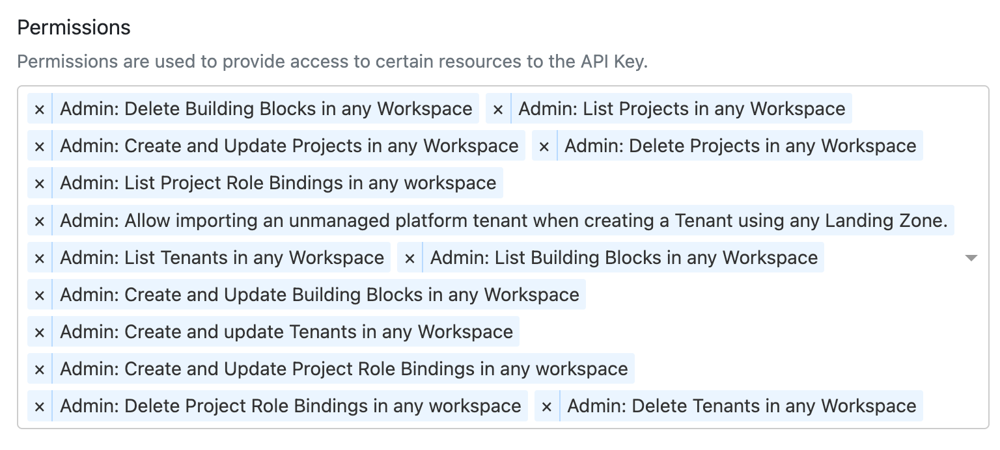

# AKS Starterkit Backplane

There is no terraform for starterkit backplane.

You need to manually create an API Key in meshStack and fill in the variables in the imported definition.

## How to create an API Key

> **Note**: you need to have Organization Admin permission in meshStack to create an API Key with admin rights.

1. In the Admin Area, go to "Access Control" > "API Keys"
2. Create a new API Key with the following permissions:

3. Copy the key ID to MESHSTACK_API_KEY and secret to MESHSTACK_API_SECRET
4. Set the MESHSTACK_ENDPOINT to your meshStack API endpoint, e.g., `https://api.<your-meshstack-domain>`
