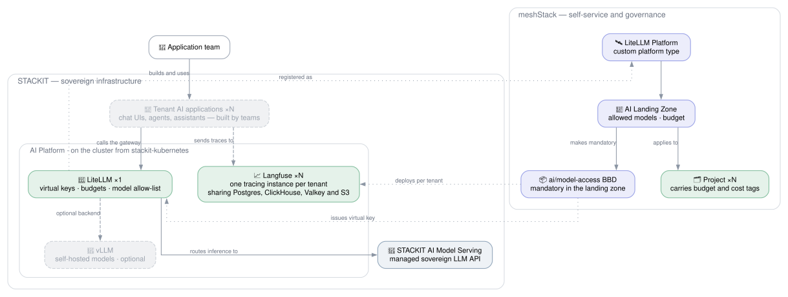
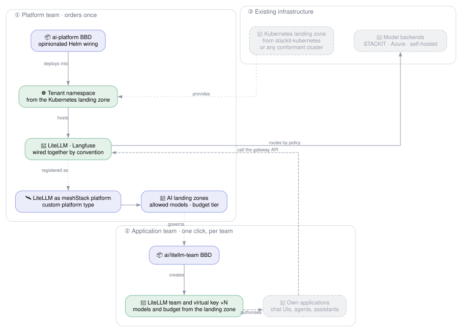
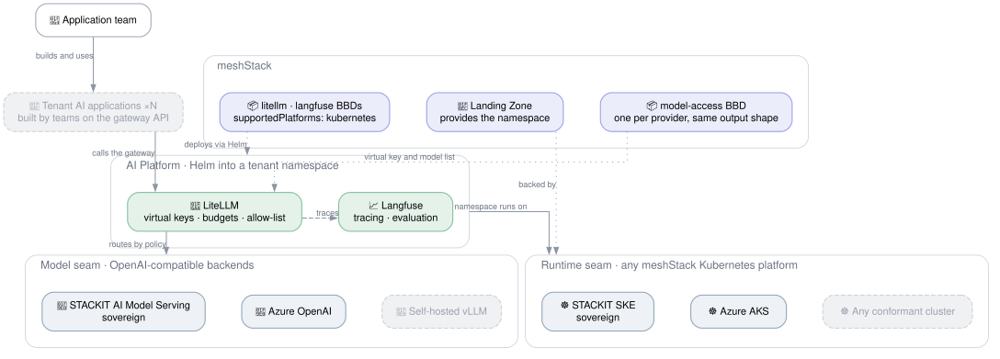

# AI Platform

## Overview

<!-- TODO: sharpen after the talk. -->

Enterprise AI adoption stalls on three questions a raw model endpoint does not answer: *who may call
which model*, *what did it cost*, and *what exactly was sent and returned*. This reference
architecture answers them with opinionated defaults rather than a toolkit: one order installs the
gateway and observability stack, and a second turns model access into a governed, self-service
catalog item.

**Target audience:**

- **Platform engineers** who want to offer LLM access as a governed product — per-team keys, budgets
  and model allow-lists — instead of handing out one shared credential.
- **Application teams** who need a stable, governed OpenAI-compatible endpoint to build on — chat
  interfaces, agents, assistants — without operating model infrastructure.

## Architecture

The diagram below shows the **STACKIT instantiation** — the sovereign reference. The platform runs on
SKE and is deliberately just two components. Every call
goes through **LiteLLM**, the single choke point where virtual keys, budgets and model allow-lists are
enforced, and which routes inference to **STACKIT AI Model Serving**. **Langfuse** traces every call
for evaluation and usage attribution. Self-hosted **vLLM** is shown muted — an optional backend, not
required when the managed sovereign API is used. Tenant applications are muted too: what teams build
on the endpoint is their business, not part of the platform.



## Delivery Model: Two Orders

The architecture is deliberately opinionated so it is ready to go rather than assembled. It splits
into one platform-team order and one application-team order.



**① Platform team, once.** An `ai-platform` building block deploys LiteLLM and Langfuse by Helm into a
tenant namespace obtained from an existing Kubernetes landing zone, pre-wired by convention: LiteLLM
points at Langfuse for tracing, and model backends are registered from the credentials it was given.

Step ① is itself a **building block ordered in the platform team's own workspace** — the reference
architecture *is* a building block, following the shape
[`stackit-landingzone`](../stackit-landingzone) already uses: a thin `meshstack_integration.tf`
declaring one BBD whose implementation points at this architecture's `buildingblock/`, which then
creates the platform, landing zones and the tenant-facing BBDs. The meshStack instance is the
Terraform runtime; the foundation repos only instantiate the architecture.

Two schema details make this work today, without waiting on any new meshStack feature:

- **`target_type = "WORKSPACE_LEVEL"`** (the default) attaches the block to the platform workspace
  rather than to a tenant. `supported_platforms` is required *only* for `TENANT_LEVEL`, so this step
  needs no platform reference at all — which is why the instance-level limitation discussed under
  [Feature Requests](#meshstack-feature-requests) does not block it.
- **The cluster credential arrives as an encrypted static input.** The architecture's Terraform holds
  the admin kubeconfig, mints a scoped one, and bakes it into the BBD — exactly what
  [`kubernetes/manifest`](../../modules/kubernetes/manifest) does at
  `meshstack_integration.tf:159`:

  ```hcl
  assignment_type = "STATIC"
  sensitive = { argument = {
    secret_value = "data:application/yaml;base64,${base64encode(module.backplane.kubeconfig)}"
  }}
  ```

  The block then applies in **one pass**, because its provider reads `file("kubeconfig.yaml")` — a
  value known at plan time. There is no unknown-after-apply problem to solve and no terragrunt-style
  two-unit split. The consequence to accept: because the credential is static, there is one BBD per
  target cluster, so cluster choice is a Terraform variable rather than an order-time selection.

**② Application team, per team.** LiteLLM is then registered as a **meshStack platform**, so ordering
model access is a normal self-service action: the landing zone carries the policy (allowed models,
budget tier), and the building block creates the LiteLLM team and virtual key behind it. This step is
per-project and needs no cluster targeting, so it is unaffected by the limitation below.

### Composition: Architectures Reuse Architectures

`ai-platform` is deliberately generic — it names no cloud and depends on neither the `stackit` nor the
`azurerm` provider. Provider-specific architectures **reuse** it and fill its two seams:

```hcl
# reference-architectures/stackit-landingzone/buildingblock/main.tf
module "ai_platform" {
  source = "github.com/meshcloud/meshstack-hub//reference-architectures/ai-platform/buildingblock?ref=${var.hub.git_ref}"
  # ... SKE for the runtime seam, STACKIT Model Serving for the model seam
}
```

Composition must use the **git URL with `?ref=${var.hub.git_ref}`**, not a relative `../../ai-platform`
path. Relative sources appear only in `e2e/` harnesses and for directories *below* a building block's
`repository_path`; a `../` escape out of the building block's own path is not a pattern this repo
relies on.

In `stackit-landingzone`, AI becomes an opt-in option shaped exactly like its existing
`variable "network"` — a nullable `object({...})` with `optional()` fields, unset meaning "sandbox
only". Enabling it plugs SKE in as the runtime and STACKIT AI Model Serving in as the model backend,
and the resulting platform is where the SKE Starterkit can then be integrated (see
[Tracked](#tracked-folding-in-the-ske-starterkit)).

Note this is new ground: no reference architecture reuses another one yet. `stackit-landingzone`'s
integration file contains no `module` blocks at all, so `ai-platform` will be the first architecture
consumed as a component.

### Option Layering in `stackit-landingzone`

AI is not the next option to add — it sits on top of a Kubernetes option that does not exist yet. The
options stack:

| Option | Provisions | Builds on |
|--------|------------|-----------|
| `network` | SNA hub network area, plus a tenant-facing `stackit/network` spoke block | — |
| `kubernetes` | A `TENANT_LEVEL` block ordering an SKE cluster into a STACKIT project, registering it as a Kubernetes platform with a namespace landing zone | `network`, for SNA placement |
| `ai` | Reuses `ai-platform`, auto-ordering a dedicated SKE cluster through the `kubernetes` option | `kubernetes` |

**The `network` → `kubernetes` hop composes today.**
[`stackit/network`](../../modules/stackit/network) already outputs `network_id`, which is exactly what
`stackit_ske_cluster.network.id` consumes — and because a network id is not a secret, a
`BUILDING_BLOCK_OUTPUT` input carries it with no missing feature. The hop that *does* need sensitive
outputs is the next one: a cluster block handing its kubeconfig to whatever installs into it.

The `kubernetes` option needs a new `modules/stackit/ske-cluster` block; SKE clusters live in
foundation Terraform today.

The AI option then takes a **nullable cluster target**, defaulting to ordering its own:

```hcl
variable "ai" {
  type = object({
    model  = string
    expose = optional(string, "public")   # public | internal
    cluster = optional(object({           # null => order a dedicated cluster
      platform_identifier = string
      landingzone         = string
    }), null)
  })
  default = null
}
```

Auto-ordering a **dedicated** cluster (dedicated to the platform team — distinct from a *private*
cluster in the networking sense below) is the default because it makes the architecture one click from
an empty STACKIT organization, and because the architecture then creates the cluster it installs into,
which sidesteps the instance-level `supported_platforms` limitation entirely. Pointing at an existing
cluster stays available for cheaper demos.

### Exposure: Public TLS by Default, Internal Opt-In

Two independent controls exist, and they are easy to conflate:

| Control | What it privatises | Status |
|---------|--------------------|--------|
| `network.control_plane.access_scope = "SNA"` | The **Kubernetes API** only | Feature-flagged, **not GA** — needs a STACKIT support ticket per org/project |
| `lb.stackit.cloud/internal-lb: "true"` | The **workload's** LoadBalancer address | GA, no flag, no ticket |

A private control plane does nothing to keep LiteLLM off the internet — that is a Service concern. The
internal-LB annotation gives the LoadBalancer an address from the node network instead of a floating
public IP, and it works as a private alternative *because* tenant projects already share the SNA when
the `network` option is enabled. Both are available in the provider version this repo already pins
(`>= 0.88.0`).

Two further constraints on the private-cluster path: `access_scope` is **immutable**, so it cannot be
flipped on an existing cluster without replacement, and it is **mutually exclusive with the ACL
extension** — private control plane, or public control plane with `extensions.acl.allowed_cidrs`, not
both.

**The default is `expose = "public"`**: HAProxy plus cert-manager and a Let's Encrypt `ClusterIssuer`,
the path the foundations already run. This exercises
[`kubernetes/ingress`](#prerequisite-cluster-ingress-and-tls) end-to-end and means the Langfuse UI
simply works in a browser. The trade-off is deliberate and worth stating plainly: the sovereign gateway
is then reachable from the internet, defended by virtual keys and optionally
`spec.loadBalancerSourceRanges`. Sovereignty here is about *where the data is processed*, not about
network reachability.

`expose = "internal"` inverts this for customers who need it, at two costs: the Langfuse UI needs VPN
or on-prem connectivity, and HTTP-01 certificate solving does not work against a private address, so
that path needs DNS-01 or an internal CA.

### Why LiteLLM Works as a meshStack Platform

LiteLLM's native concepts already form a tenancy model, which is what meshStack replicates into:

| meshStack | LiteLLM |
|-----------|---------|
| Project | Team |
| Landing zone | Allowed models, budget and rate-limit tier |
| Tenant credential | Virtual key |
| Project roles | Team membership |

This is expressible today: `meshstack_platform` supports `spec.config.custom.platform_type_ref`, and
there is a precedent in this repo — [`modules/stackit`](../../modules/stackit) registers STACKIT
itself as a **custom** platform type, with the actual tenant provisioning done by the
[`stackit/project`](../../modules/stackit/project) building block. A LiteLLM platform would follow
the same shape, with a `litellm/team` building block in place of `stackit/project`.

### Why No Chat UI in the Core

The platform is the **governed API**, not an end-user product. A bundled UI such as OpenWebUI was
considered and deliberately left out:

- It is an **application, not plumbing**. LiteLLM and Langfuse are what every AI workload needs;
  a chat UI is one specific product built *on* them — and teams will build their own.
- It brings its own **user, group and per-group model permissions**, a second policy store competing
  with LiteLLM. "Who may call which model" must have exactly one home, and that home is the landing
  zone plus the virtual key.
- Its built-in RAG stack duplicates the already-dropped RAG layer.
- A shared UI cuts across the tenant boundary the virtual key defines, forcing its user list to be
  reconciled against meshStack projects.

The counter-argument is real — a URL you can chat at beats an API key for demos and for business
users who will never write a client. That is why it stays a candidate *optional* catalog block a team
orders into its own namespace with its own key, making it the first example consumer of the platform
rather than part of it. See open question 5.

## Pluggability: Two Independent Seams

The demo stack was built so infrastructure and model serving are replaceable. That generalises into
**two orthogonal seams**, and because they are orthogonal this is *one* reference architecture rather
than a STACKIT and an Azure fork. Running on SKE while calling Azure OpenAI, or on AKS while calling
STACKIT, are both valid combinations.

This is why the architecture is named for the capability rather than a cloud: cloud-agnostic
components live in `modules/ai/`, and each provider contributes only a small model-access module.

| Seam | Contract | Chosen by | Implementations |
|------|----------|-----------|-----------------|
| **Runtime** — where the components run | A landing zone that hands out Kubernetes namespaces; the blocks declare `supportedPlatforms: kubernetes` and never name a cloud | The landing zone the platform team orders into | STACKIT SKE, Azure AKS, any conformant cluster |
| **Model** — where inference happens | An OpenAI-compatible endpoint plus credential, surfaced as a LiteLLM `model_list` entry | LiteLLM routing policy, fed by one model-access block per provider | `stackit/model-serving`, an Azure OpenAI equivalent, self-hosted vLLM |



### The Model Seam as a Contract

The model seam is a plain map keyed by the model name application teams request, deliberately split so
that only the secrets are marked sensitive:

```hcl
variable "model_backends" {
  description = "OpenAI-compatible model backends registered in the LiteLLM gateway, keyed by model name."
  type = map(object({
    litellm_model = string                      # "openai/neuralmagic/Mistral-7B", "azure/gpt-4o-prod"
    api_base      = string
    extra_params  = optional(map(string), {})   # provider quirks, e.g. api_version
  }))
}

variable "model_backend_api_keys" {
  description = "API keys for the model backends, keyed by the same model name as model_backends."
  type        = map(string)
  sensitive   = true
}
```

Splitting the keys out matters in practice: marking one combined structure `sensitive` would collapse
model names, endpoints and versions into `(sensitive value)` in every plan, hiding exactly the
human-readable detail a reviewer needs to check. Keeping the two maps in step is the caller's job, and
the architecture validates that every `model_backends` key has a matching entry.

This keeps `ai-platform` free of the `stackit` and `azurerm` providers entirely — it works because
STACKIT AI Model Serving, Azure OpenAI and self-hosted vLLM are all OpenAI-compatible from LiteLLM's
point of view. "Bring your own model" is then a config value, not a hub PR.

Adding a cloud therefore means adding one small model-access module with the same output shape — not
changing the architecture. The runtime seam needs no per-cloud work at all: the precedent is
[`kubernetes/manifest`](../../modules/kubernetes/manifest), a runtime-agnostic Helm building block
that takes a kubeconfig and declares `supportedPlatforms: kubernetes`.

This architecture **consumes** a Kubernetes cluster, it does not provision one — which is why
[`stackit-kubernetes`](../stackit-kubernetes) stays a separate, companion reference architecture.

### Prerequisite: Cluster Ingress and TLS

LiteLLM and Langfuse both need a routable HTTPS endpoint with a valid certificate, so the runtime seam
has one requirement beyond "hands out namespaces": an ingress controller and a certificate issuer. That
capability does not exist in the hub yet — `modules/kubernetes/` holds only `manifest` and
`service-account` — and it is currently **copy-pasted across the foundation repos**:

| Location | cert-manager | Notes |
|----------|--------------|-------|
| `likvid-cloudfoundation` — SKE | v1.20.0 | |
| `internal-cloudfoundation` — SKE | v1.20.0 | byte-identical to likvid's SKE copy |
| `trial-cloudfoundation` — SKE | v1.20.0 | byte-identical to likvid's SKE copy |
| `likvid-cloudfoundation` — AKS | v1.19.4 | plus an Azure load-balancer health-probe annotation |

All four are `platforms/*/kubernetes/addons/` — cert-manager, an HAProxy ingress controller, and a
Let's Encrypt `ClusterIssuer` — and the version drift between the SKE and AKS copies is the argument
for consolidating them into a single `modules/kubernetes/ingress`.

The module is shaped by **capability, not by tool**: one building block delivering "my services get a
public HTTPS URL with a valid certificate". Bundling the issuer with the controller is not arbitrary —
the foundations' `ClusterIssuer` hardcodes `ingressClassName = "haproxy"` in its HTTP-01 solver, so the
issuer is not independently useful.

It also lets the foundations drop a module. Today the `ClusterIssuer` needs its own terragrunt unit
because `kubernetes_manifest` requires the CRD to exist at plan time. Rendering it through a local Helm
chart instead — the `chart = path.module` pattern
[`kubernetes/manifest`](../../modules/kubernetes/manifest) already uses — removes the plan-time schema
lookup, so `addons/` and `addons/certmanager/` collapse into one.

## Deployment vs Tenancy

The platform components are deployed **once** and are internally multi-tenant. Nothing is deployed per
application team:

| Component | Deployments | Tenancy unit | Provisioned by |
|-----------|-------------|--------------|----------------|
| LiteLLM | one, shared | Team + virtual key | `ai/litellm-team` |
| Langfuse | one, shared | Organization/project + scoped API key | `ai/litellm-team` |
| STACKIT AI Model Serving | managed service | Token in the tenant's own STACKIT project | `stackit/model-serving` |

This is forced for LiteLLM — a gateway only enforces budgets and allow-lists if everything goes
through one instance — and chosen for Langfuse, where per-tenant deployments would be disproportionate
(recent Langfuse versions need ClickHouse and Redis alongside Postgres, so each tenant install would
carry a full data stack).

The trade-off to accept consciously: **isolation rests on Langfuse's project boundary, not on a
Kubernetes or network boundary**, and the shared instances are a common blast radius — if Langfuse is
down, no team has tracing. For a sovereignty story this is usually fine, since the data never leaves
the cluster; a tenant with stricter isolation requirements would need its own deployment, which this
architecture does not attempt.

## Token Scope: Per-Tenant

Each tenant gets **its own STACKIT Model Serving token**, issued into its own STACKIT project, rather
than LiteLLM holding one shared platform credential. This is an opinionated call — the shared-token
variant is simpler and legitimate for some platform engineering setups — made for three reasons:

- **Clean provider hierarchy.** The credential lives in the tenant's own STACKIT project, so the
  STACKIT resource hierarchy keeps reflecting the tenant structure instead of collapsing all AI usage
  onto one platform project.
- **Cost attribution without new plumbing.** Because spend lands on the tenant's own project, it flows
  through whatever STACKIT cost path the platform already uses, rather than needing an AI-specific
  path that reconstructs per-team spend from gateway data and pushes it back into meshStack.
- **Blast radius.** One tenant's credential can be revoked or rotated without touching anyone else.

**Ordering stays one click.** The app team's flow is identical to the shared-token variant — the extra
work is inside the building block, which touches two systems: it issues the STACKIT token in the
tenant's project *and* registers the corresponding deployment, team and virtual key in LiteLLM. Two
consequences to design for:

- **Two-system consistency.** A token created but not registered in LiteLLM leaves an orphan. The
  block needs to be idempotent and to clean up on partial failure.
- **Rotation touches both.** Token TTL expiry must update the gateway too, not just STACKIT.

## Governance and Observability

<!-- TODO: talking points — confirm which of these the demo actually showed. -->

| Concern | Where it is enforced |
|---------|----------------------|
| Which models a team may call | LiteLLM model allow-list, bound to the virtual key |
| Spend per team | LiteLLM budget on the virtual key; project budget in meshStack |
| Rate limiting / noisy neighbours | LiteLLM per-key rate limits |
| Prompt and response audit | Langfuse traces |
| Quality regression tracking | Langfuse evaluations |
| Cost attribution and chargeback | Langfuse usage → meshStack project cost tags |
| Credential rotation | Building block re-order / token TTL |

## Open Questions

<!-- Decisions for the session. -->

1. **Module scaffolding.** Only `stackit/model-serving` exists. The cloud-agnostic components belong
   in a new `modules/ai/` namespace — `ai/litellm`, `ai/langfuse` and the tenant-facing
   `ai/litellm-team` — plus `modules/kubernetes/ingress` for the TLS/ingress prerequisite and
   `modules/stackit/ske-cluster` for the `kubernetes` option the AI option builds on. None are written
   yet. This architecture also still needs its own `buildingblock/` and `meshstack_integration.tf` to
   become orderable.
2. **Bootstrap ordering — resolved for one apply.** Two credentials, two mechanisms. The *cluster*
   credential is a `STATIC` encrypted input read back through `file()`, so it is known at plan time.
   The *LiteLLM admin key* is generated by the architecture itself (`random_password`) and passed into
   the Helm values, with the endpoint derived from a known hostname — so nothing needs to be read out
   of a resource that has not been created yet, and `depends_on` is sufficient. Provider configurations
   *may* reference resource attributes; they fail only when the value is unknown at plan time, which
   neither of these is.
3. **Provisioning mechanism — resolved.** No LiteLLM or Langfuse Terraform provider exists, so
   `ai/litellm-team` drives both admin APIs with `Mastercard/restapi`, already the established pattern
   in this repo (13 usages), with `hashicorp/helm` for the chart deploys. No new pattern needed.
4. **Metering.** The custom platform type accepts metering configuration; whether LiteLLM spend can
   feed meshStack chargeback is unresolved.
5. **Optional chat UI.** A ready-made UI such as OpenWebUI is valuable for demos and for business
   users who will not build their own client. Should it ship as an optional catalog block teams order
   into their own namespace with their own virtual key?
6. **Dropped from the demo.** FlowiseAI (agent/workflow builder) and RAGFlow (RAG and data layer) were
   left out to keep the focus on serving, observability and governance. Follow-up architecture?

## meshStack Feature Requests

**Instance-level `supported_platforms` on building block definitions.** Today
`meshstack_building_block_definition.supported_platforms.kind` is documented as *"Always
`meshPlatformType` for now"* — a block can declare it supports `kubernetes`, but not *which*
Kubernetes platform. By contrast `meshstack_landingzone.platform_ref` already targets a specific
platform by uuid.

This does **not** block step ①, since a `WORKSPACE_LEVEL` block needs no `supported_platforms` at all.
It bites on the tenant-facing blocks and on making cluster choice an order-time decision:

- The realistic topology is **two SKE clusters** — one hosting the shared AI platform, one hosting
  application workloads such as the SKE Starterkit. Without instance-level support, a `TENANT_LEVEL`
  block offered for type `kubernetes` appears orderable on both.
- It would let the platform engineer answer "which cluster?" as a normal platform reference. The
  workaround today is one BBD per cluster with the kubeconfig baked in as a static input, or a
  `PLATFORM_OPERATOR_MANUAL_INPUT` kubeconfig field — which does support `sensitive`, but turns a
  reference into hand-carried credentials.
- The other workaround — registering each cluster as its own custom platform type — inflates the
  platform-type list to express what is really an instance selection.

**Sensitive outputs between building blocks.** The gap here is narrower than it first appears, and
worth stating precisely. Sensitive input values *are* supported — for `USER_INPUT`,
`PLATFORM_OPERATOR_MANUAL_INPUT` and `STATIC` — which is what makes the encrypted-kubeconfig pattern
above work. They are excluded for exactly one assignment type, `BUILDING_BLOCK_OUTPUT`, and outputs
themselves are typed `STRING | CODE | INTEGER | BOOLEAN` with no sensitive variant.

So composition itself is fine: `dependency_refs` plus `BUILDING_BLOCK_OUTPUT` already works, and
[`ske/forgejo-connector`](../../modules/ske/forgejo-connector) uses both today. Non-secret facts flow
between blocks without trouble — ingress class, cluster issuer name, load-balancer IP, hostname — so
this architecture routes around the gap by keeping the **secret path** static and encrypted while the
**dependency path** carries only public values.

What remains blocked is the genuinely self-service case: one block *creating* a cluster and another
consuming its kubeconfig at runtime. Today that credential would have to be a plaintext `CODE` output
visible in meshPanel. Closing this is the prerequisite for the SKE cluster itself becoming an orderable
building block rather than foundation Terraform.

## Tracked: Folding In the SKE Starterkit

Not in scope for the first iteration, recorded so it is not lost.

The [`ske/ske-starterkit`](../../modules/ske/ske-starterkit) demo app already calls an AI model, but
its credential is injected statically — foundations supply a STACKIT model-serving token through
their own `ai.tf`. The goal is for the starterkit to consume this reference architecture instead, so
its demo app becomes a live example of a governed AI workload.

**The seam already exists and is already the right shape.** The starterkit injects AI config through
`forgejo-connector`'s `additional_kubernetes_secrets` as a `stackit-ai` secret holding three values:

| Variable | Today | With this architecture |
|----------|-------|------------------------|
| `STACKIT_AI_BASE_URL` | STACKIT Model Serving endpoint | The LiteLLM gateway URL |
| `STACKIT_AI_API_KEY` | A statically provisioned token | The team's LiteLLM virtual key |
| `STACKIT_AI_MODEL` | A fixed model name | A model from the landing zone's allow-list |

Because LiteLLM is OpenAI-compatible, this needs **no change to the starterkit's interface** — only
different values. Two notes: the `STACKIT_AI_*` prefix becomes a misnomer once the gateway fronts
several providers (renaming to `OPENAI_BASE_URL` / `OPENAI_API_KEY` would additionally make most
client SDKs work with zero configuration), and routing the demo app through the gateway means its
traffic shows up in Langfuse and counts against the team's budget — which is the point.

**Delivery:** AI becomes an opt-in option on
[`stackit-landingzone`](../stackit-landingzone), shaped like its existing `variable "network"`, which
reuses this architecture as a component — see
[Composition](#composition-architectures-reuse-architectures). The SKE Starterkit is then a further
option that requires the AI option to be enabled.

There is no layering conflict here, because the **SKE cluster is itself an offering inside a STACKIT
project**: the STACKIT LZ provisions the project, the SKE cluster building block turns it into a
Kubernetes platform, and that platform's landing zone hands out the namespaces the AI components and
the starterkit need. Note the cluster building block does not exist in the hub yet — SKE clusters are
provisioned by foundation Terraform today (`platforms/ske/kubernetes/cluster.tf` in the
cloudfoundation repos), so hub-ifying it as `modules/stackit/ske-cluster` behind the `kubernetes`
option is a prerequisite — see [Option Layering](#option-layering-in-stackit-landingzone). It is also
the one place the sensitive-output gap genuinely bites: an orderable cluster block would need to hand
its kubeconfig to the blocks installing into it.

## Getting Started

### Prerequisites

| Requirement          | Description                                                                    |
|----------------------|--------------------------------------------------------------------------------|
| Kubernetes landing zone | A meshStack landing zone providing namespaces — STACKIT SKE or Azure AKS.    |
| Model backend        | STACKIT AI Model Serving enabled, or an equivalent OpenAI-compatible endpoint.   |
| meshStack instance   | With Terraform/OpenTofu IaC runtime configured.                                 |

### Deployment Order

<!-- TODO -->

## Shared Responsibilities

| Responsibility                                              | Platform Team | Application Team |
|-------------------------------------------------------------|:---:|:---:|
| Operate the Kubernetes cluster hosting the platform          | ✅ | ❌ |
| Install and upgrade LiteLLM and Langfuse                     | ✅ | ❌ |
| Decide which models are offered and to whom                  | ✅ | ❌ |
| Define landing zones: allowed models, budgets, rate limits   | ✅ | ❌ |
| Register and maintain building block definitions             | ✅ | ❌ |
| Order model access from the self-service catalog             | ❌ | ✅ |
| Stay within the granted budget and model allow-list          | ❌ | ✅ |
| Review own traces and evaluations in their Langfuse project   | ❌ | ✅ |
| Build and operate the AI application or assistant            | ❌ | ✅ |

## Notes for the Session

<!-- Scratch space — remove before merging. -->

- Demo components in scope: LiteLLM, Langfuse, STACKIT AI Model Serving.
- OpenWebUI was dropped from the core: it is an application, not platform plumbing, and its built-in
  user/group model permissions would be a second policy store competing with LiteLLM. Its RAG half
  also duplicates the already-dropped RAGFlow. Kept as a candidate optional block (see open question 5).
- Original demo ran on Scaleway; only the runtime and model-serving layers need swapping.
- Hub modules still missing for the platform components themselves — only `stackit/model-serving` is
  scaffolded, as a minimal first cut around `stackit_modelserving_token` (the only AI-specific
  resource in the STACKIT provider, v0.88.0).
