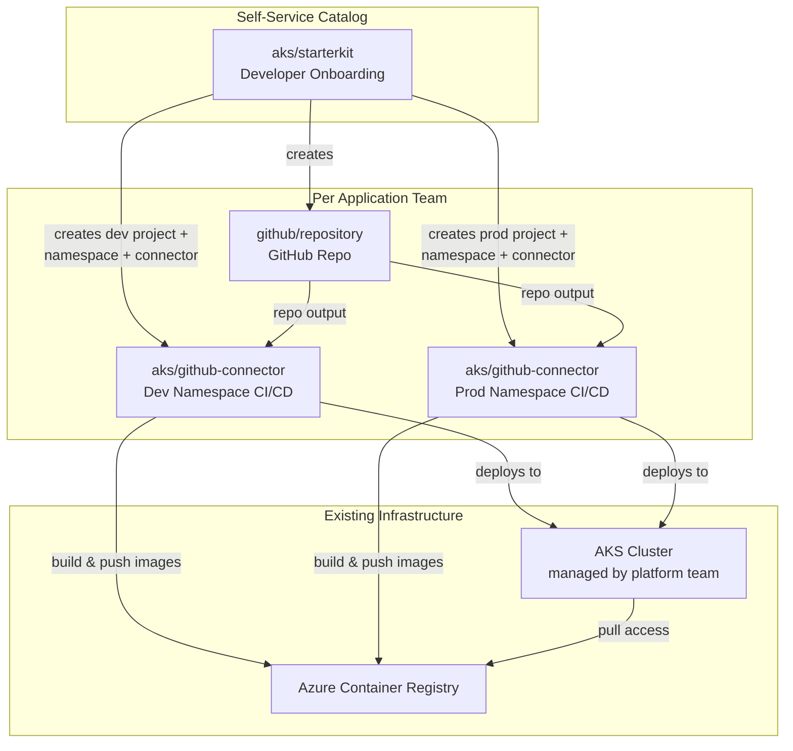

# Azure Kubernetes Platform

## Overview

The **Azure Kubernetes Platform** (AKS) reference architecture delivers a complete, self-service
Kubernetes experience on Azure. It combines three Hub building blocks into a cohesive
platform that allows application teams to go from "I need a place to run my app" to
"my code is deployed" in minutes — without filing tickets or waiting for manual
provisioning.

It assumes the platform team already operates one or more AKS clusters. This architecture
layers developer self-service on top of those clusters.

**Target audience:**

- **Platform engineers** who already have AKS clusters and want to add self-service onboarding.
- **Application teams** who need a fast, secure path to Kubernetes with built-in CI/CD.

## Architecture Diagram

## How It Works

### 1. Developer Starterkit — `aks/starterkit`

The starterkit is a **meshStack building block composition** that application teams
request from the self-service catalog. When a developer clicks "Order", the starterkit
automatically:

1. Creates a **GitHub repository** from a configurable template
   (`github/repository`).
2. Creates a **dev project** with a dedicated AKS namespace and wires it to the repo
   via a **GitHub Actions connector** (`aks/github-connector`).
3. Creates a **prod project** with a separate AKS namespace and connector that
   triggers on the `release` branch.
4. Grants the requesting developer **Project Admin** on both projects.

### 2. GitHub Repository — `github/repository`

Each application team gets its own repository with:

- Predefined structure (Dockerfile, Kubernetes manifests, GitHub Actions workflow).
- Branch protection rules and team-based access control.
- Template-based initialization for consistent project scaffolding.

### 3. CI/CD Pipeline — `aks/github-connector`

The connector building block creates:

- A **Kubernetes service account** scoped to the target namespace.
- **GitHub Actions environment secrets** for cluster authentication and container
  registry access.
- A **GitHub Actions workflow** that builds, scans, and deploys on every push.

Separate connector instances for dev and prod ensure workload isolation while sharing
the same repository.

## Getting Started

### Prerequisites

| Requirement         | Description                                                            |
|---------------------|------------------------------------------------------------------------|
| meshStack instance  | With Terraform/OpenTofu IaC runtime configured.                        |
| AKS cluster         | An existing AKS cluster with a kubeconfig available for the connector. |
| GitHub organization | With a GitHub App installed for the Terraform GitHub provider.         |

## Shared Responsibilities

| Responsibility | Platform Team | Application Team |
| --- | --- | --- |
| Provision and manage AKS cluster | ✅ | ❌ |
| Register and maintain building block definitions | ✅ | ❌ |
| Configure GitHub App & template repositories | ✅ | ❌ |
| Order starterkit from the self-service catalog | ❌ | ✅ |
| Develop and maintain application source code | ❌ | ✅ |
| Manage Kubernetes resources inside namespaces | ❌ | ✅ |
| Merge to release branch for production deployments | ❌ | ✅ |
| Monitor application health and logs | ❌ | ✅ |

