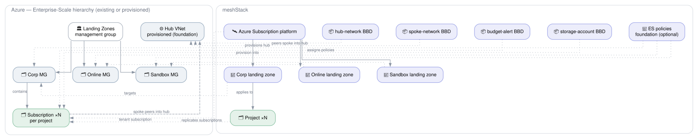

# Azure Landing Zone

## Overview

The **Azure Landing Zone** reference architecture turns an existing Azure Enterprise-Scale
management group hierarchy into a self-service-ready meshStack platform in one run using its own
Terraform code.

The **management group hierarchy** — Corp, Online, Sandbox and Connectivity — is by default
**provisioned by the architecture** under the bootstrap scope (the parent management group given at
registration), so end users configure nothing about management groups. Set
`azure_create_management_groups = false` to instead use an existing hierarchy (passed via the
`azure_*_management_group` inputs). The MCA billing setup and the connectivity subscription are
always assumed to exist. On top of the hierarchy the architecture wires meshStack and can lay the
remaining optional `foundation` (hub network, policies, resource groups).

Running it once **always**:

1. Registers the **Azure Subscription** platform in meshStack, with the replicator and metering
   identities scoped to the landing-zones management group.
2. Creates one **landing zone per Enterprise-Scale archetype** — Corp (internal, hub-connected),
   Online (internet-facing) and Sandbox (experimentation) — each pointing at its management group,
   so a subscription ordered through a landing zone lands in the matching management group.
3. Registers the **Azure Hub Network**, **Azure Spoke Network**, **Azure Budget Alert** and
   **Azure Storage Account** building blocks. Each creates its own backplane — a User-Assigned
   Managed Identity federated to the building block definition — so it can be ordered into landing
   zone subscriptions (or, for the hub, the connectivity subscription).

And **optionally** (via the `foundation` input):

4. Provisions the **management group hierarchy** — Landing Zones → Corp/Online/Sandbox plus
   Connectivity — under a given parent (e.g. the tenant root group). The created groups are then
   used everywhere instead of the `azure_*_management_group` inputs.
5. Provisions a central **hub vnet** (with an optional Azure Firewall) in the connectivity
   subscription by ordering a Hub Network instance; spoke networks then peer into it.
6. Assigns curated **Enterprise-Scale policies** to the Corp/Online/Sandbox management groups
   (Corp locked down, Online region-restricted, Sandbox audit-only).
7. Creates extra platform-owned **resource groups** in the platform subscription.

**Target audience:**

- **Platform engineers** onboarding an existing Enterprise-Scale Azure tenant into meshStack who
  want landing zones and ready-to-order building blocks without hand-wiring the platform,
  landing zones and backplanes separately.
- **Application teams** who request Azure subscriptions through a landing zone and order the
  registered building blocks into them.

## Architecture Diagram

The left cluster is the **existing Azure hierarchy** — the landing-zones management group, the Corp,
Online and Sandbox management groups beneath it, and the central hub vnet. The right cluster is
**meshStack** — the platform, its three landing zones and the building block definitions. Dotted
edges across the boundary show how each meshStack construct maps onto its Azure counterpart: each
landing zone targets a management group, the platform replicates subscriptions into them, and the
spoke-network building block peers a spoke vnet into the hub.

## How It Works

The architecture is a **one-time platform onboarding building block** — a one-click experience:

1. A platform engineer applies [`meshstack_integration.tf`](meshstack_integration.tf) once (locally
   with `az login`, or via an IaC runtime). This **registers the building block definition** in
   meshStack **and** provisions a privileged [`bootstrap/`](bootstrap/) identity — a User-Assigned
   Managed Identity federated to this definition, granted **Owner** on the given scope and Microsoft
   Graph **`Application.ReadWrite.All`**. Applying this step requires an identity that is Owner on
   the scope and can grant Graph app roles (Global Admin / Privileged Role Administrator) — a
   deliberately privileged, one-time bootstrap.
2. The building block is then **ordered/run in meshStack**, which executes it **as the bootstrap
   identity** (workload identity federation, no stored secret). That run does the actual work: it
   creates the management group hierarchy (under the bootstrap scope), registers the Azure platform
   and landing zones, and provisions the optional `foundation` (hub, policies, resource groups) plus
   the building block backplanes.

See [`buildingblock/`](buildingblock/) for the composition and [`bootstrap/`](bootstrap/) for the
identity.

Once applied, application teams request Azure subscriptions through the Corp, Online or Sandbox
landing zone; each subscription is placed in the archetype's management group. They then order the
registered building blocks:

- **Azure Spoke Network** deploys a spoke vnet into the ordering tenant's own subscription and peers
  it into the hub — pair it with the **Corp** landing zone for hub-connected workloads.
- **Azure Budget Alert** and **Azure Storage Account** currently target the platform subscription
  (`azure_platform_subscription_id`); see the buildingblock inputs.

## Getting Started

### Prerequisites

| Requirement | Description |
|-------------|-------------|
| Management group hierarchy | A parent management group (the bootstrap scope) under which the architecture creates Corp/Online/Sandbox/Connectivity by default; or, with `azure_create_management_groups = false`, an existing hierarchy passed via the `azure_*_management_group` inputs. |
| MCA billing | Billing account, profile and invoice section names for subscription provisioning. |
| Network hub | An existing hub vnet (subscription, resource group and vnet name) for spoke networks to peer into. |
| Azure identity (to apply the integration) | Owner on the bootstrap `scope` and the ability to grant Microsoft Graph app roles (Global Administrator / Privileged Role Administrator), on the CLI (`az login`) or as an IaC runtime identity. Used once to create the bootstrap identity + register the definition; the ordered run itself then authenticates as the bootstrap identity via WIF. |

### Deployment Order

Apply the architecture once per workspace. It registers the platform, the three landing zones and
the three building blocks in a single run. Application teams can then request subscriptions and
order the building blocks.

## Shared Responsibilities

| Responsibility | Platform Team | Application Team |
|----------------|:---:|:---:|
| Maintain the management group hierarchy, billing and network hub | ✅ | ❌ |
| Register the Azure platform and the Corp/Online/Sandbox landing zones | ✅ | ❌ |
| Register the budget-alert, storage-account and spoke-network building blocks | ✅ | ❌ |
| Request Azure subscriptions through the landing zones | ❌ | ✅ |
| Order the registered building blocks into their subscriptions | ❌ | ✅ |
| Manage workloads inside the provisioned subscriptions | ❌ | ✅ |
