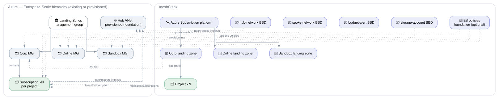

# Azure Landing Zone

## Overview

The **Azure Landing Zone** reference architecture turns an existing Azure Enterprise-Scale
management group hierarchy into a self-service-ready meshStack platform in one run using its own
Terraform code.

The **management group hierarchy** — Corp, Online, Sandbox and Connectivity — is **provisioned by
the architecture** under a parent management group the platform engineer provides when ordering
(`azure_management_groups.parent_management_group_id`), so end users configure nothing about
management groups. The MCA billing setup and the connectivity subscription are always assumed to
exist. On top of the hierarchy the architecture wires meshStack and can lay the remaining optional
`foundation` (hub network, policies, resource groups).

Running it once **always**:

1. Registers the **Azure Subscription** platform in meshStack, with the replicator and metering
   identities scoped to the landing-zones management group.
2. Creates one **landing zone per Enterprise-Scale archetype** — Corp (internal, hub-connected),
   Online (internet-facing) and Sandbox (experimentation) — each pointing at its management group,
   so a subscription ordered through a landing zone lands in the matching management group.
3. Registers the **Azure Hub Network**, **Azure Spoke Network**, **Azure Budget Alert** and
   **Azure Storage Account** building blocks. Each creates its own backplane — a User-Assigned
   Managed Identity federated to the building block definition — so it can be ordered into landing
   zone subscriptions (or, for the hub, the connectivity subscription).

And **optionally**, driven by toggles that reveal their settings only when switched on:

4. Provisions a central **hub vnet** (with an optional Azure Firewall) in the connectivity
   subscription — enable **Provision Hub Network**; spoke networks then peer into it.
5. Assigns curated **Enterprise-Scale policies** to the Corp/Online/Sandbox management groups
   (Corp locked down, Online region-restricted, Sandbox audit-only) — **Assign Enterprise-Scale
   Policies**, on by default.
6. Creates extra platform-owned **resource groups** in the platform subscription — **Platform
   Resource Groups**.

**Target audience:**

- **Platform engineers** onboarding an existing Enterprise-Scale Azure tenant into meshStack who
  want landing zones and ready-to-order building blocks without hand-wiring the platform,
  landing zones and backplanes separately.
- **Application teams** who request Azure subscriptions through a landing zone and order the
  registered building blocks into them.

## Architecture Diagram

The left cluster is the **existing Azure hierarchy** — the landing-zones management group, the Corp,
Online and Sandbox management groups beneath it, and the central hub vnet. The right cluster is
**meshStack** — the platform, its three landing zones and the building block definitions. Dotted
edges across the boundary show how each meshStack construct maps onto its Azure counterpart: each
landing zone targets a management group, the platform replicates subscriptions into them, and the
spoke-network building block peers a spoke vnet into the hub.

## How It Works

The architecture is a **one-time platform onboarding building block** — a one-click experience:

1. A platform engineer registers the building block definition by applying
   [`meshstack_integration.tf`](meshstack_integration.tf) once. This only creates the definition in
   meshStack — no Azure resources and no Azure credentials are needed at this step.
2. Beforehand the engineer creates one **service principal** — Owner on the parent management group
   and granted the Microsoft Graph app roles `Application.ReadWrite.All`, `Directory.Read.All` and
   `AppRoleAssignment.ReadWrite.All` — and, when **ordering the building block in meshStack**, enters
   its client id, secret and tenant (the secret is a sensitive input). The ordered run authenticates
   as that principal and does the actual work: it creates the management group hierarchy under the
   given parent, registers the Azure platform and landing zones, and provisions the optional
   `foundation` (hub, policies, resource groups) plus the building block backplanes.

See [`buildingblock/`](buildingblock/) for the composition.

Once applied, application teams request Azure subscriptions through the Corp, Online or Sandbox
landing zone; each subscription is placed in the archetype's management group. They then order the
registered building blocks:

- **Azure Spoke Network** deploys a spoke vnet into the ordering tenant's own subscription and peers
  it into the hub — pair it with the **Corp** landing zone for hub-connected workloads.
- **Azure Budget Alert** and **Azure Storage Account** currently target the platform subscription
  (`azure_platform_subscription_id`); see the buildingblock inputs.

## Getting Started

### Prerequisites

| Requirement | Description |
|-------------|-------------|
| Parent management group | An existing management group (or the tenant ID) under which the architecture creates the Corp/Online/Sandbox/Connectivity hierarchy. |
| MCA billing | Billing account, profile and invoice section names for subscription provisioning. |
| Network hub | An existing hub vnet (subscription, resource group and vnet name) for spoke networks to peer into. |
| Azure service principal | A service principal with **Owner** on the parent management group and the Microsoft Graph app roles `Application.ReadWrite.All`, `Directory.Read.All` and `AppRoleAssignment.ReadWrite.All`. Its client id, secret and tenant are entered when ordering; the ordered run authenticates as it. Creating such a principal requires a tenant admin (Global Administrator / Privileged Role Administrator) once. |

### Deployment Order

Apply the architecture once per workspace. It registers the platform, the three landing zones and
the three building blocks in a single run. Application teams can then request subscriptions and
order the building blocks.

## Shared Responsibilities

| Responsibility | Platform Team | Application Team |
|----------------|:---:|:---:|
| Maintain the management group hierarchy, billing and network hub | ✅ | ❌ |
| Register the Azure platform and the Corp/Online/Sandbox landing zones | ✅ | ❌ |
| Register the budget-alert, storage-account and spoke-network building blocks | ✅ | ❌ |
| Request Azure subscriptions through the landing zones | ❌ | ✅ |
| Order the registered building blocks into their subscriptions | ❌ | ✅ |
| Manage workloads inside the provisioned subscriptions | ❌ | ✅ |
