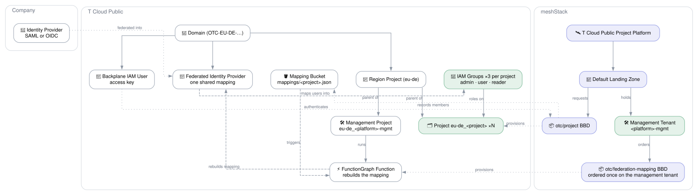

# T Cloud Public Landing Zone

## Overview

The **T Cloud Public Landing Zone** reference architecture turns a T Cloud Public domain into a
self-service-ready meshStack platform in one step. Application teams create meshStack projects in
its landing zone, and each one becomes a T Cloud Public project `<region>_<project>`, with access
that follows the meshStack project's roles.

Access runs through the company identity provider. T Cloud Public federates it into the domain, and
users sign in as virtual users. meshStack does not create IAM users. Instead, every project
building block writes mapping rules that put a project's users, matched by email, into that
project's IAM groups at sign-in.

**Target audience:**

- **Platform engineers** onboarding a T Cloud Public domain into meshStack who want application
  teams to get projects self-service, with access governed in meshStack and authenticated by the
  company identity provider.
- **Application teams** who need a T Cloud Public project and want to manage who can use it by
  managing their meshStack project.

## Architecture Diagram

The left half shows the company identity provider and the **T Cloud Public domain**: the backplane
IAM user, the identity provider federated into the domain, and the tenant projects under the region
project, each with its IAM groups. The right half is **meshStack**: the platform, its landing zone
and the project building block definition. Dotted edges across the boundary show how each meshStack
construct acts on T Cloud Public. Green nodes are created once per meshStack project; the management tenant is one of them.

## How It Works

Running this reference architecture:

1. Creates a **meshStack location**, unless the global location is chosen.
2. Sources the [`modules/otc`](../../modules/otc) platform integration, which:
   - creates the **backplane IAM user** `mesh-<platform identifier>` with an access key, in a group
     holding Security Administrator on the domain and Tenant Administrator on all projects. The
     building blocks this architecture registers authenticate as it;
   - with an identity provider, federates the **company identity provider** (SAML or OIDC) and
     creates the **mapping bucket** projects record their members in;
   - creates the meshStack **platform type** `OTC-<PLATFORM IDENTIFIER>`, one per landing zone so
     that several can share a meshStack instance;
   - registers the **T Cloud Public Project** platform, its default landing zone and the
     [`otc/project`](../../modules/otc/project) building block definition as the landing zone's
     mandatory building block.
3. Creates the **management project**: a meshProject `<platform identifier>-mgmt` in the workspace,
   with the workspace's owners and managers as Project Admins, and a tenant on the new platform. The
   project building block provisions it like any other project, as `<region>_<platform identifier>-mgmt`.
4. With an identity provider, registers the
   [`otc/federation-mapping`](../../modules/otc/federation-mapping) building block definition and
   orders it once on the management project.

For every meshStack project in the landing zone, the `otc/project` building block then:

1. Creates the project `<region>_<project>` under the region's project.
2. Creates one IAM group per meshStack role and gives it the T Cloud Public system roles that the
   **role mapping** names, on that project.
3. Records which emails belong in which of its groups as `mappings/<region>_<project>.json` in the
   mapping bucket.

### Identity: federation, not replication

T Cloud Public gives a federated user their groups at sign-in, from the identity provider's mapping
rules. So meshStack never writes users or group memberships. The mapping rules are the only place
membership lives, and meshStack remains the source of truth for who is on a project.

An identity provider has a single mapping that every project contributes to, so no project writes
it. Each project only writes its own record in the bucket, which no other project touches. The
federation mapping building block runs a FunctionGraph function in the management project that
rebuilds the whole mapping from all records:

- whenever a record is written or deleted (an OBS trigger on `mappings/*.json`),
- and every hour regardless, which repairs a dropped event.

The function runs one instance at a time, so two rebuilds never interleave. A role change in
meshStack applies from the user's next sign-in after the rebuild, usually seconds later.

Without an identity provider (the input left empty), projects and groups are still created, but
nobody is mapped into them. The platform team then has to add IAM users to the groups by hand.

### Authentication

T Cloud Public's Terraform provider cannot exchange an OIDC token for credentials, so meshStack's
workload identity federation is not usable yet:

- This building block runs with an **access key and secret key** you supply, of an IAM user in the
  domain's `admin` group. They are used on every run.
- The project and federation mapping building blocks run as the **backplane IAM user**, whose access
  key reaches meshStack as sensitive static inputs.
- The function holds no key at all: it acts as an agency delegated to FunctionGraph.

## Getting Started

### Prerequisites

| Requirement | Description |
|---|---|
| T Cloud Public domain | With an IAM user in the domain's `admin` group, and an access key for it. Use the account name exactly as the console shows it, e.g. `OTC-EU-DE-00000000001000000000`. |
| Identity provider *(recommended)* | SAML metadata, or the OIDC issuer, client ID and JWKS signing keys. The email claim or attribute must carry exactly the address meshStack knows for each user. For OIDC, register the IdP's redirect URI shown in the T Cloud Public console. |

### Deployment Order

Order the **T Cloud Public Landing Zone** building block once per workspace. In the same run it
creates the platform, the landing zone and the project building block definition, then the
management project through that landing zone, then the federation mapping building block on it.
Application teams can then create meshStack projects in the landing zone.

### Playground Mode

`playground_mode` defaults to `true`, so an unconfigured deployment is a throwaway one. The platform
identifier and the backplane IAM user name get a random suffix, because a platform identifier is
unique across the whole meshStack instance, and an IAM user name is unique across the domain.

**A playground platform is for the deploying workspace only.** Do not publish it or its project
building block definition to other workspaces. Set `playground_mode = false` for a platform that is
actually used. The flag reaches the building block as a `STATIC` input, so whoever orders the
architecture cannot change it.

### Approval Gates

`approval_policies` sets which run triggers need an operator's approval before a run of this
architecture is applied. It defaults to no gate at all.

## Not Yet Covered

- **Hub-and-spoke networking.** T Cloud Public documents a hub VPC with a NAT gateway and spoke
  VPCs peered to it. A hub building block and a self-service spoke VPC building block would add it.
  T Cloud Public has no built-in IP address management, so the address plan would need its own
  allocation.
- **Security baseline.** A Cloud Trace Service tracker writing to a KMS-encrypted OBS bucket, and the
  domain's password, login and protection policies.
- **Project starterkit** that creates a meshStack project and its T Cloud Public project in one order.

## Shared Responsibilities

| Responsibility | Platform Team | Application Team |
|---|:---:|:---:|
| Provide the admin access key, domain and role mapping | ✅ | ❌ |
| Run the management project and the federation mapping function in it | ✅ | ❌ |
| Federate the company identity provider and keep its signing keys current | ✅ | ❌ |
| Provision the T Cloud Public Project platform and default landing zone | ✅ | ❌ |
| Request T Cloud Public projects through the landing zone | ❌ | ✅ |
| Decide who is on each project, and with which role | ❌ | ✅ |
| Build and run workloads inside the projects | ❌ | ✅ |
