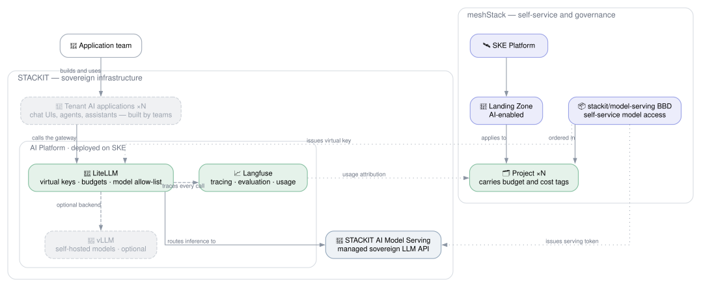
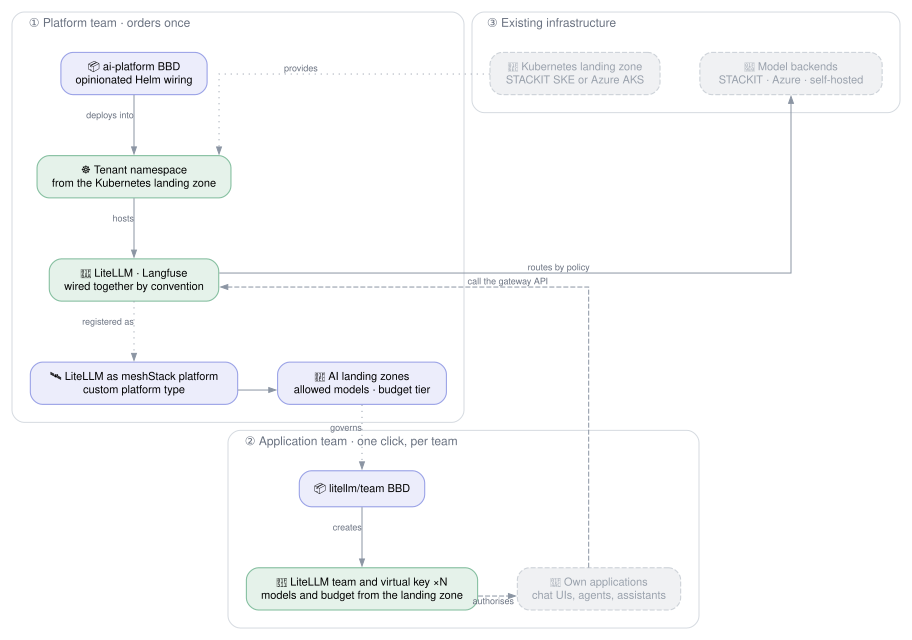
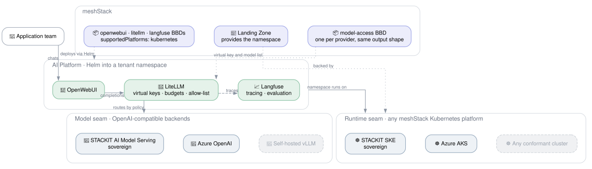

# STACKIT AI

## Overview

<!-- TODO: sharpen after the talk. -->

Enterprise AI adoption stalls on three questions a raw model endpoint does not answer: *who may call
which model*, *what did it cost*, and *what exactly was sent and returned*. This reference
architecture answers them with opinionated defaults rather than a toolkit: one order installs the
gateway and observability stack, and a second turns model access into a governed, self-service
catalog item.

**Target audience:**

- **Platform engineers** who want to offer LLM access as a governed product — per-team keys, budgets
  and model allow-lists — instead of handing out one shared credential.
- **Application teams** who need a stable, governed OpenAI-compatible endpoint to build on — chat
  interfaces, agents, assistants — without operating model infrastructure.

## Architecture

The **AI platform** runs on SKE inside STACKIT and is deliberately just two components. Every call
goes through **LiteLLM**, the single choke point where virtual keys, budgets and model allow-lists are
enforced, and which routes inference to **STACKIT AI Model Serving**. **Langfuse** traces every call
for evaluation and usage attribution. Self-hosted **vLLM** is shown muted — an optional backend, not
required when the managed sovereign API is used. Tenant applications are muted too: what teams build
on the endpoint is their business, not part of the platform.

## Delivery Model: Two Orders

The architecture is deliberately opinionated so it is ready to go rather than assembled. It splits
into one platform-team order and one application-team order.

**① Platform team, once.** An `ai-platform` building block deploys LiteLLM and Langfuse by Helm into a
tenant namespace obtained from an existing Kubernetes landing zone, pre-wired by convention: LiteLLM
points at Langfuse for tracing, and model backends are registered from the credentials it was given.

**② Application team, per team.** LiteLLM is then registered as a **meshStack platform**, so ordering
model access is a normal self-service action: the landing zone carries the policy (allowed models,
budget tier), and the building block creates the LiteLLM team and virtual key behind it.

### Why LiteLLM Works as a meshStack Platform

LiteLLM's native concepts already form a tenancy model, which is what meshStack replicates into:

| meshStack | LiteLLM |
|-----------|---------|
| Project | Team |
| Landing zone | Allowed models, budget and rate-limit tier |
| Tenant credential | Virtual key |
| Project roles | Team membership |

This is expressible today: `meshstack_platform` supports `spec.config.custom.platform_type_ref`, and
there is a precedent in this repo — [`modules/stackit`](../../modules/stackit) registers STACKIT
itself as a **custom** platform type, with the actual tenant provisioning done by the
[`stackit/project`](../../modules/stackit/project) building block. A LiteLLM platform would follow
the same shape, with a `litellm/team` building block in place of `stackit/project`.

### Why No Chat UI in the Core

The platform is the **governed API**, not an end-user product. A bundled UI such as OpenWebUI was
considered and deliberately left out:

- It is an **application, not plumbing**. LiteLLM and Langfuse are what every AI workload needs;
  a chat UI is one specific product built *on* them — and teams will build their own.
- It brings its own **user, group and per-group model permissions**, a second policy store competing
  with LiteLLM. "Who may call which model" must have exactly one home, and that home is the landing
  zone plus the virtual key.
- Its built-in RAG stack duplicates the already-dropped RAG layer.
- A shared UI cuts across the tenant boundary the virtual key defines, forcing its user list to be
  reconciled against meshStack projects.

The counter-argument is real — a URL you can chat at beats an API key for demos and for business
users who will never write a client. That is why it stays a candidate *optional* catalog block a team
orders into its own namespace with its own key, making it the first example consumer of the platform
rather than part of it. See open question 5.

## Pluggability: Two Independent Seams

The demo stack was built so infrastructure and model serving are replaceable. That generalises into
**two orthogonal seams** — and because they are orthogonal, this should stay *one* reference
architecture rather than forking into a STACKIT and an Azure variant. Running on SKE while calling
Azure OpenAI, or on AKS while calling STACKIT, are both valid combinations.

| Seam | Contract | Chosen by | Implementations |
|------|----------|-----------|-----------------|
| **Runtime** — where the components run | A landing zone that hands out Kubernetes namespaces; the blocks declare `supportedPlatforms: kubernetes` and never name a cloud | The landing zone the platform team orders into | STACKIT SKE, Azure AKS, any conformant cluster |
| **Model** — where inference happens | An OpenAI-compatible endpoint plus credential, surfaced as a LiteLLM `model_list` entry | LiteLLM routing policy, fed by one model-access block per provider | `stackit/model-serving`, an Azure OpenAI equivalent, self-hosted vLLM |

Adding a cloud therefore means adding one small model-access module with the same output shape — not
changing the architecture. The runtime seam needs no per-cloud work at all: the precedent is
[`kubernetes/manifest`](../../modules/kubernetes/manifest), a runtime-agnostic Helm building block
that takes a kubeconfig and declares `supportedPlatforms: kubernetes`.

This architecture **consumes** a Kubernetes cluster, it does not provision one — which is why
[`stackit-kubernetes`](../stackit-kubernetes) stays a separate, companion reference architecture.

## Governance and Observability

<!-- TODO: talking points — confirm which of these the demo actually showed. -->

| Concern | Where it is enforced |
|---------|----------------------|
| Which models a team may call | LiteLLM model allow-list, bound to the virtual key |
| Spend per team | LiteLLM budget on the virtual key; project budget in meshStack |
| Rate limiting / noisy neighbours | LiteLLM per-key rate limits |
| Prompt and response audit | Langfuse traces |
| Quality regression tracking | Langfuse evaluations |
| Cost attribution and chargeback | Langfuse usage → meshStack project cost tags |
| Credential rotation | Building block re-order / token TTL |

## Open Questions

<!-- Decisions for the session. -->

1. **Scope and name.** If both seams are real, this is an *AI platform* reference architecture with
   `cloudProviders: [stackit, azure]`, not a STACKIT-only one — STACKIT would be the sovereign
   reference instantiation. That implies renaming the folder and finding a home for the
   runtime-agnostic modules outside `modules/stackit/`.
2. **Bootstrap ordering.** The LiteLLM platform can only be registered once LiteLLM is reachable (URL
   plus admin credential). `stackit-landingzone` already registers a platform and orders a building
   block instance in one apply, so there is a precedent — but the dependency needs designing.
3. **Provisioning mechanism.** There is no LiteLLM Terraform provider as far as we know, so the
   `litellm/team` block would drive LiteLLM's admin API. Needs confirming.
4. **Metering.** The custom platform type accepts metering configuration; whether LiteLLM spend can
   feed meshStack chargeback is unresolved.
5. **Optional chat UI.** A ready-made UI such as OpenWebUI is valuable for demos and for business
   users who will not build their own client. Should it ship as an optional catalog block teams order
   into their own namespace with their own virtual key?
6. **Dropped from the demo.** FlowiseAI (agent/workflow builder) and RAGFlow (RAG and data layer) were
   left out to keep the focus on serving, observability and governance. Follow-up architecture?

## Tracked: Folding In the SKE Starterkit

Not in scope for the first iteration, recorded so it is not lost.

The [`ske/ske-starterkit`](../../modules/ske/ske-starterkit) demo app already calls an AI model, but
its credential is injected statically — foundations supply a STACKIT model-serving token through
their own `ai.tf`. The goal is for the starterkit to consume this reference architecture instead, so
its demo app becomes a live example of a governed AI workload.

**The seam already exists and is already the right shape.** The starterkit injects AI config through
`forgejo-connector`'s `additional_kubernetes_secrets` as a `stackit-ai` secret holding three values:

| Variable | Today | With this architecture |
|----------|-------|------------------------|
| `STACKIT_AI_BASE_URL` | STACKIT Model Serving endpoint | The LiteLLM gateway URL |
| `STACKIT_AI_API_KEY` | A statically provisioned token | The team's LiteLLM virtual key |
| `STACKIT_AI_MODEL` | A fixed model name | A model from the landing zone's allow-list |

Because LiteLLM is OpenAI-compatible, this needs **no change to the starterkit's interface** — only
different values. Two notes: the `STACKIT_AI_*` prefix becomes a misnomer once the gateway fronts
several providers (renaming to `OPENAI_BASE_URL` / `OPENAI_API_KEY` would additionally make most
client SDKs work with zero configuration), and routing the demo app through the gateway means its
traffic shows up in Langfuse and counts against the team's budget — which is the point.

**Delivery idea to validate:** expose AI as an opt-in option the same way
[`stackit-landingzone`](../stackit-landingzone) exposes networking — a nullable object variable
(`variable "network"`, unset = sandbox only) — with the SKE Starterkit as a further option that
requires the AI option to be enabled. Open layering question: the STACKIT Landing Zone hands out
STACKIT **projects**, while the AI platform needs a Kubernetes **namespace**, so the option may
belong at the SKE/Kubernetes layer instead.

## Getting Started

### Prerequisites

| Requirement          | Description                                                                    |
|----------------------|--------------------------------------------------------------------------------|
| Kubernetes landing zone | A meshStack landing zone providing namespaces — STACKIT SKE or Azure AKS.    |
| Model backend        | STACKIT AI Model Serving enabled, or an equivalent OpenAI-compatible endpoint.   |
| meshStack instance   | With Terraform/OpenTofu IaC runtime configured.                                 |

### Deployment Order

<!-- TODO -->

## Shared Responsibilities

| Responsibility                                              | Platform Team | Application Team |
|-------------------------------------------------------------|:---:|:---:|
| Operate the Kubernetes cluster hosting the platform          | ✅ | ❌ |
| Install and upgrade LiteLLM and Langfuse                     | ✅ | ❌ |
| Decide which models are offered and to whom                  | ✅ | ❌ |
| Define landing zones: allowed models, budgets, rate limits   | ✅ | ❌ |
| Register and maintain building block definitions             | ✅ | ❌ |
| Order model access from the self-service catalog             | ❌ | ✅ |
| Stay within the granted budget and model allow-list          | ❌ | ✅ |
| Review own traces and evaluations in Langfuse                | ❌ | ✅ |
| Build and operate the AI application or assistant            | ❌ | ✅ |

## Notes for the Session

<!-- Scratch space — remove before merging. -->

- Demo components in scope: LiteLLM, Langfuse, STACKIT AI Model Serving.
- OpenWebUI was dropped from the core: it is an application, not platform plumbing, and its built-in
  user/group model permissions would be a second policy store competing with LiteLLM. Its RAG half
  also duplicates the already-dropped RAGFlow. Kept as a candidate optional block (see open question 5).
- Original demo ran on Scaleway; only the runtime and model-serving layers need swapping.
- Hub modules still missing for the platform components themselves — only `stackit/model-serving` is
  scaffolded, as a minimal first cut around `stackit_modelserving_token` (the only AI-specific
  resource in the STACKIT provider, v0.88.0).
