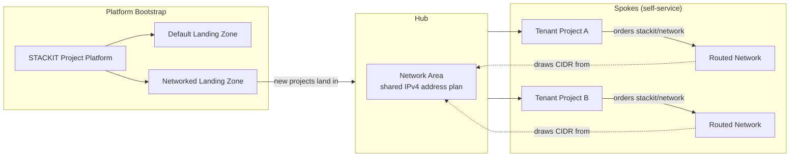

# STACKIT Hub-and-Spoke Network

## Overview

The **STACKIT Hub-and-Spoke Network** reference architecture turns a bare STACKIT organization
into a self-service-ready meshStack platform with IPAM built in: a shared network-area address
plan (the hub) that all tenant projects draw from, and a self-service routed-network building
block (the spoke) application teams can order inside their own projects. It builds on the
[STACKIT Sandbox Landing Zone](../stackit-sandbox-landingzone/README.md) foundation.

**Target audience:**

- **Platform engineers** bootstrapping a new STACKIT organization who want network segmentation
  from day one, without hand-wiring a network area and its address plan separately.
- **Application teams** who need a dedicated IPv4 subnet inside their STACKIT project without
  manually coordinating CIDR ranges with the platform team.

## Architecture Diagram

Application teams order a routed network into their own project via the self-service
`stackit/network` building block; each order draws its subnet from the hub's address plan,
so no two spokes can accidentally collide on CIDR ranges.

## How It Works

Running this reference architecture:

1. Sources the [STACKIT Sandbox Landing Zone](../stackit-sandbox-landingzone/README.md) to
   create the landing-zone folder, backplane project, and the **STACKIT Project** platform with
   its default landing zone.
2. Registers the [`stackit/network-area`](../../modules/stackit/network-area) building block
   definition and immediately orders **one instance** of it in the platform team's own
   workspace — this is the hub's IPv4 address plan.
3. Registers the [`stackit/network`](../../modules/stackit/network) building block definition
   (`TENANT_LEVEL`) so application teams can self-service order routed networks (spokes) inside
   their STACKIT projects, drawing from the hub's address plan.
4. Provisions an additional **networked landing zone**, tagged with the hub's network area ID,
   so new STACKIT projects created against it are placed in the hub's network area.

## Getting Started

### Prerequisites

| Requirement          | Description                                                                       |
|-----------------------|------------------------------------------------------------------------------------|
| STACKIT organization | With a service account key that has `resource-manager.admin` on the organization. |
| CIDR plan            | A non-overlapping IPv4 address plan chosen up front for the hub network ranges and transfer network. |

### Deployment Order

Order the **STACKIT Hub and Spoke Network** building block once per workspace. It creates the
platform, the hub network area instance, and registers the spoke `stackit/network` building
block in a single apply. Application teams can then order `stackit/network` inside their own
STACKIT projects once those projects exist.

## Shared Responsibilities

| Responsibility                                                          | Platform Team | Application Team |
|---------------------------------------------------------------------------|:---:|:---:|
| Provision the STACKIT platform and landing zones                         | ✅ | ❌ |
| Provision the hub network area and choose its address plan               | ✅ | ❌ |
| Register the spoke `stackit/network` building block for self-service     | ✅ | ❌ |
| Order spoke networks inside their STACKIT projects                       | ❌ | ✅ |
| Use the assigned subnet for their workloads                              | ❌ | ✅ |
