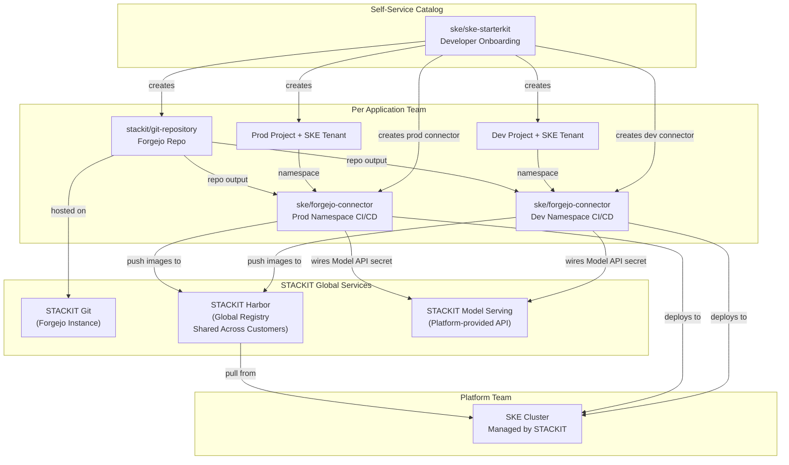

# STACKIT Kubernetes Platform

## Overview

The **STACKIT Kubernetes Platform** reference architecture delivers a complete,
sovereign-cloud Kubernetes experience on [STACKIT](https://www.stackit.de/). It combines
three Hub building blocks into a cohesive platform that gives application teams self-service
access to Kubernetes namespaces with integrated Git repositories and CI/CD pipelines —
all running on European infrastructure with full data sovereignty. Each team receives
a ready-to-use ai-summarizer demo application with provisioned access to STACKIT Model Serving,
a sovereign LLM API, ensuring even AI capabilities remain under full data control.

**Target audience:**

- **Platform engineers** building an internal developer platform on STACKIT.
- **Application teams** who need a fast, secure path to Kubernetes with built-in CI/CD
  in a sovereign cloud environment.

## Architecture Diagram

## How It Works

### 1. STACKIT Kubernetes Engine (SKE)

SKE is a managed Kubernetes service provided by STACKIT. The platform team provisions
and maintains the cluster(s); application teams consume namespaces via meshStack tenants.
SKE handles control-plane management, upgrades, and scaling automatically.

### 2. Developer Starterkit — `ske/ske-starterkit`

The starterkit is the **single entry point** for application teams. When a developer
orders the starterkit from the meshStack self-service catalog, the following resources
are created automatically:

1. **Forgejo Git repository** (`stackit/git-repository`) — a code repository hosted
   on STACKIT Git (Forgejo), optionally cloned from a template URL. Workspace members
   get team-based access (Owner → admin, Manager → write, others → read).

2. **Dev project with SKE tenant** — a meshStack project with a dedicated Kubernetes
   namespace on SKE, assigned to the dev landing zone.

3. **Dev Forgejo connector** (`ske/forgejo-connector`) — wires the Git repo to the
   dev namespace so that pushes to `dev` trigger a Forgejo Actions workflow that
   builds, pushes to the STACKIT Harbor global registry, and deploys to the dev namespace.

4. **Prod project with SKE tenant** — same as above but assigned to the prod landing
   zone.

5. **Prod Forgejo connector** — wires the Git repo to the prod namespace, triggered
   by pushes to the `prod` branch.

6. **Project Admin binding** — the requesting developer is granted Project Admin on
   both projects.

### 3. Forgejo Git Repository — `stackit/git-repository`

Each application team's repository includes:

- **Team-based access** managed via Forgejo organization teams, synced from meshStack
  workspace membership.
- **Forgejo Actions secrets** — `KUBECONFIG_DEV`, `KUBECONFIG_PROD`, container
  registry credentials, and `STACKIT_MODEL_SERVING_API_KEY` are injected automatically
  by the connector.
- **Forgejo Actions variables** — `K8S_NAMESPACE_DEV`, `K8S_NAMESPACE_PROD`,
  `APP_HOSTNAME_DEV`, `APP_HOSTNAME_PROD`, and `STACKIT_MODEL_SERVING_ENDPOINT` are
  made available to Forgejo Actions for use during Helm chart installation, avoiding
  hardcoded configuration values in stage-aware deployments.
- **Template repository** — optionally cloned from a template URL, pre-configured
  with an ai-summarizer sample application that uses the STACKIT Model Serving API.

### 4. CI/CD Pipeline — `ske/forgejo-connector`

The connector building block creates per-stage resources:

- **Kubernetes service account & RBAC** scoped to the tenant namespace, including
  read access to cert-manager cluster issuers.
- **Harbor image-pull secret** attached to the default service account so pods can
  pull images from the STACKIT Harbor registry.
- **Model Serving API secret** — a Kubernetes secret containing the `STACKIT_MODEL_SERVING_API_KEY`
  is provisioned in each dev/prod namespace, allowing applications to authenticate
  with the STACKIT Model Serving endpoint.
- **Forgejo Actions secrets & variables** for the stage-specific kubeconfig,
  namespace, Model Serving credentials, and app hostname.
- **Pipeline trigger** — after provisioning, the connector triggers the Forgejo
  Actions workflow and waits for it to complete.

## Getting Started

### Prerequisites

| Requirement          | Description                                                                                                                                       |
|----------------------|---------------------------------------------------------------------------------------------------------------------------------------------------|
| meshStack instance   | With Terraform/OpenTofu IaC runtime configured.                                                                                                   |
| STACKIT account      | With access to SKE, STACKIT Git, and the global STACKIT Harbor registry.                                                                          |
| SKE cluster          | A running STACKIT Kubernetes Engine cluster with kubeconfig.                                                                                      |
| Forgejo organization | On STACKIT Git, with an API token for the Terraform provider.                                                                                     |
| Harbor credentials   | Robot account credentials (username and secret) for push/pull access to the STACKIT global Harbor registry; shared across all STACKIT customers. |
| Model Serving API    | STACKIT Model Serving endpoint and API key for the platform team to provide to the connector.                                                     |
| DNS zone             | A DNS zone provided by STACKIT for application ingress hostnames (e.g. `apps.example.com`).                                                      |

## Shared Responsibilities

| Responsibility                                           | Platform Team | Application Team |
|----------------------------------------------------------| --- | --- |
| Provision and manage SKE cluster                         | ✅ | ❌ |
| Configure STACKIT Git (Forgejo) organization             | ✅ | ❌ |
| Manage Harbor project in global registry and credentials | ✅ | ❌ |
| Register and maintain building block definitions         | ✅ | ❌ |
| Manage STACKIT DNS zone for app hostnames                | ✅ | ❌ |
| Order starterkit from the self-service catalog           | ❌ | ✅ |
| Develop and maintain application source code             | ❌ | ✅ |
| Manage Kubernetes resources inside namespaces            | ❌ | ✅ |
| Maintain Forgejo Actions pipeline (`pipeline.yaml`)      | ❌ | ✅ |
| Monitor application health and logs                      | ❌ | ✅ |

## Why Sovereign Cloud?

This architecture runs entirely on STACKIT — a European cloud provider operated by
Schwarz Group. All data stays within EU data centers, meeting requirements for:

- **GDPR compliance** — data processing within the EU.
- **Data sovereignty** — no dependency on US-based hyperscaler infrastructure.
- **Industry regulations** — suitable for public sector, healthcare, and financial
  services workloads that require European data residency.
- **AI sovereignty** — your AI usage stays entirely European with STACKIT Model Serving.

