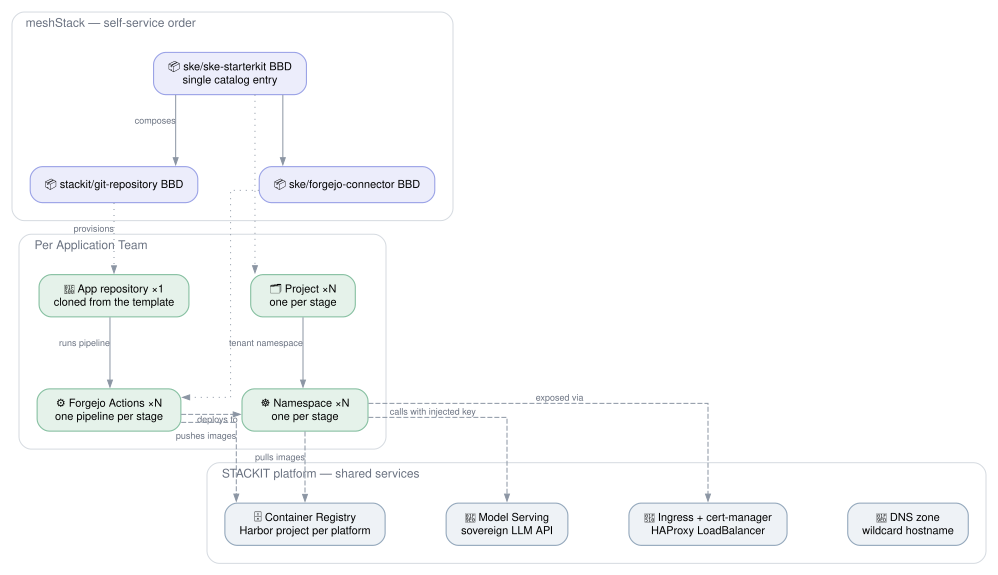
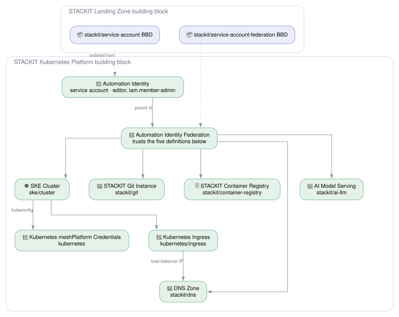

# STACKIT Kubernetes Platform

## Overview

The **STACKIT Kubernetes Platform** reference architecture delivers a complete,
sovereign-cloud Kubernetes experience on [STACKIT](https://www.stackit.de/). It combines
several Hub building blocks into a cohesive platform that gives application teams self-service
access to Kubernetes namespaces with integrated Git repositories and CI/CD pipelines —
all running on European infrastructure with full data sovereignty. Each team receives
a ready-to-use ai-summarizer demo application with provisioned access to STACKIT Model Serving,
a sovereign LLM API, ensuring even AI capabilities remain under full data control.

**Target audience:**

- **Platform engineers** building an internal developer platform on STACKIT.
- **Application teams** who need a fast, secure path to Kubernetes with built-in CI/CD
  in a sovereign cloud environment.

## Architecture

A platform engineer bootstraps the platform once; application teams then self-serve on it. The two
views split along that line.

### Platform team — one-time bootstrap

Ordered once on top of a deployed
[STACKIT Landing Zone](https://hub.meshcloud.io/reference-architectures/stackit-landingzone) (see
[What It Builds On](#what-it-builds-on-one-landing-zone-block)), it registers the SKE platform and
its building block definitions and provisions the STACKIT infrastructure. Each definition sits
directly above the resource it provisions.

### Per application team — self-service and runtime

An application team orders one starterkit and receives a repository, a project and namespace per
stage, and a CI/CD pipeline. The dashed edges are the running application's data flow across the
platform's shared STACKIT services.

## How It Works

### 1. STACKIT Kubernetes Engine (SKE)

SKE is a managed Kubernetes service provided by STACKIT. The platform team provisions
and maintains the cluster(s); application teams consume namespaces via meshStack tenants.
SKE handles control-plane management, upgrades, and scaling automatically.

### 2. Developer Starterkit — `ske/ske-starterkit`

The starterkit is the **single entry point** for application teams. When a developer
orders the starterkit from the meshStack self-service catalog, the following resources
are created automatically:

1. **Forgejo Git repository** (`stackit/git-repository`) — a code repository hosted
   on STACKIT Git (Forgejo), cloned from the template repository. Workspace members
   get team-based access (Owner → admin, Manager → write, others → read). The starterkit
   sets the application's image name on it as the `APP_NAME` Actions variable.

2. **One project with an SKE tenant per stage** — a meshStack project with a dedicated
   Kubernetes namespace on SKE, assigned to that stage's landing zone. The stages are
   the ones the platform offers, `dev` and `prod` by default.

3. **One Forgejo connector per stage** (`ske/forgejo-connector`) — wires the Git repo to
   that stage's namespace so that pushes to the stage's branch trigger a Forgejo Actions
   workflow that builds, pushes to the platform's Harbor project, and deploys to the namespace.

4. **Project Admin binding** — the requesting developer is granted Project Admin on
   every project.

### 3. Forgejo Git Repository — `stackit/git-repository`

Each application team's repository includes:

- **Team-based access** managed via Forgejo organization teams, synced from meshStack
  workspace membership.
- **Forgejo Actions secrets** — `KUBECONFIG_<STAGE>` per stage and the Harbor push
  robot as `HARBOR_USERNAME` / `HARBOR_PASSWORD`, injected by the connector.
- **Forgejo Actions variables** — `HARBOR_REGISTRY` and `HARBOR_PROJECT` for the whole
  platform, `APP_NAME` from the starterkit, and `K8S_NAMESPACE_<STAGE>` and
  `APP_HOSTNAME_<STAGE>` per stage from the connector, so stage-aware deployments need
  no hardcoded configuration.
- **Template repository** — cloned from the template URL, pre-configured with an
  ai-summarizer sample application that uses the STACKIT Model Serving API.

### 4. CI/CD Pipeline — `ske/forgejo-connector`

The connector building block creates per-stage resources:

- **Kubernetes service account & RBAC** scoped to the tenant namespace, including
  read access to cert-manager cluster issuers.
- **Harbor image-pull secret** attached to the default service account so pods can
  pull images from the STACKIT Harbor registry.
- **Model Serving secret** — a `stackit-ai` Kubernetes secret with `STACKIT_AI_BASE_URL`,
  `STACKIT_AI_API_KEY` and `STACKIT_AI_MODEL` in each stage's namespace, so applications
  can call STACKIT Model Serving.
- **Forgejo Actions secrets & variables** for the stage-specific kubeconfig,
  namespace and app hostname.
- **Pipeline trigger** — after provisioning, the connector triggers the Forgejo
  Actions workflow and waits for it to complete.

## What It Builds On: One Landing Zone Block

This architecture sits on top of a deployed
[STACKIT Landing Zone](https://hub.meshcloud.io/reference-architectures/stackit-landingzone). That
landing zone provides the STACKIT organization structure, the foundation project and the platform
this architecture's hosting project is created on — and nothing Kubernetes- or Git-specific. It does
not register the SKE cluster or STACKIT Git definitions; **this architecture registers those itself,
once per ordered platform**, so every platform owns its own definitions and its own service
account.

Wiring is a single input, **STACKIT Landing Zone**. You copy its value from the summary of the landing
zone building block, which shows it as a code block. It holds

- `platform_ref` and `landingzone_refs` — the meshPlatform and landing zone the hosting project is
  created on, and
- `service_account_bbd_version_ref` and `service_account_federation_bbd_version_ref` — the
  **STACKIT Service Account** and **STACKIT Service Account Federation** definitions this
  architecture orders to mint its own identity and to federate its definitions into it.

**No STACKIT credential crosses that boundary, and this architecture holds none.** Its own apply
declares no `stackit` provider at all. It orders the service account definition on the hosting tenant
it just created, granting the account `editor` and `iam.member-admin`. As a child of that, it orders
the federation definition with the uuids of the SKE Cluster, STACKIT Git, Container Registry, DNS and
AI Model Serving definitions it registered, in `federated_building_block_definitions`. Each of those
building blocks is a child of the federation and names the account in its
`STACKIT_SERVICE_ACCOUNT_EMAIL` input, so every STACKIT resource here is created by a child building
block authenticating through workload identity federation.

The federation is a building block of its own because the service account must not depend on the
definitions it federates. See [the building block tree](#building-block-tree) for why.

Adding a STACKIT capability to this architecture means adding its role to the landing zone's
`stackit_assignable_roles`, its definition's uuid to `federated_building_block_definitions`, and the
federation to its building block's parents. It never means adding a credential.

## Building Block Tree

Every building block below the platform names its parents in `parent_building_block_refs`, so
meshPanel shows this tree and meshStack runs a child only after its parents:

- **Automation Identity** is the root. It creates the service account and depends on no definition
  of this architecture.
- **Automation Identity Federation** is its child. It needs the uuids of the five definitions whose
  runs act as the account, so it can only be ordered after they are registered.
- The five blocks that act as the account are children of the federation. The Kubernetes meshPlatform
  Credentials and the Ingress are also children of the cluster, because they take its kubeconfig. The
  DNS zone is also a child of the Ingress, because it takes the load balancer IP.

Two rules keep this tree deletable:

- **Delete a child's definition before its parent's.** meshStack deletes a definition's building
  blocks with it, and fails with a `fk_tbb_Parent` foreign key error if one of them is still the
  parent of another block. So `dns_integration` depends on `ingress_integration`, and
  `ingress_integration` on `cluster_integration`.
- **The service account depends on no definition it federates.** If it did, a parent definition
  that reads the account's email and its child definition would depend on each other, and OpenTofu
  would report a cycle. That is why the federation is a building block of its own.

## Ordering It: One Order, One Update

One run provisions everything:

- the hosting STACKIT project (a self-hosted meshStack tenant), the platform's service account and
  its federation,
- the **SKE Cluster**, **STACKIT Git Instance**, **Container Registry**, **DNS Zone** and **AI Model
  Serving** building block definitions, registered for this platform and federated into that
  service account,
- the SKE cluster,
- **ingress** (`kubernetes/ingress`) — cert-manager, the HAProxy ingress controller and the Let's
  Encrypt ClusterIssuer, in a single building block,
- the **meshStack Kubernetes integration** (`kubernetes`), which creates the replicator and metering
  identities and registers the meshStack platform they are wired into, with one landing zone per
  stage,
- the **DNS zone** with a wildcard record pointing at the ingress load balancer, and the **AI Model
  Serving** token,
- the **STACKIT Git instance** (`stackit/git`) — named after the platform identifier, because
  `<name>.git.onstackit.cloud` is globally unique across all of STACKIT, which is why a playground
  deployment suffixes that identifier — with its **Forgejo organization** and the **STACKIT-hosted
  shared runner** it orders through `shared_runner_labels`, labelled `stackit-ubuntu-22` for the
  application workflows,
- the **container registry**, with every meshStack user on the platform's project granted a STACKIT
  registry role so the Harbor project is visible to them, and the template's base images mirrored
  into it through `mirrored_base_images`.

The one step left is the Harbor bootstrap robot, which only the STACKIT portal can create. The
summary says how. Updating the building block with its name in **Harbor Bootstrap Robot Name**
registers the **STACKIT Git Repository**, **SKE Forgejo Connector** and **SKE Starterkit**
definitions, so application teams can order a repository wired to their namespaces.

### Where the Forgejo token comes from

No human mints it. The Git building block switches on local login, creates a technical user through
the STACKIT Git API, and exchanges that user's password for a Personal Access Token, which it
reports as an output. This architecture reads that output and passes it to the Git Repository and
Forgejo Connector definitions. See
`modules/stackit/git/buildingblock/README.md` for the three calls involved.

## Getting Started

### Prerequisites

| Requirement          | Description                                                                                                          |
|----------------------|----------------------------------------------------------------------------------------------------------------------|
| meshStack instance   | With Terraform/OpenTofu IaC runtime configured.                                                                      |
| STACKIT Landing Zone | A deployed STACKIT Landing Zone building block. The code block in its summary is the only value wired into this architecture — see above. |
| STACKIT portal       | Access to the platform's Harbor project, to create its one bootstrap robot account.                                 |

### The Harbor bootstrap robot is still a manual step

The container registry building block creates the Harbor project and mints the push and pull robots,
but only from a robot that already exists. The Harbor API opens only to an identity Harbor already
knows, and only the portal can link the first robot to a STACKIT service account. That robot's name
is the one optional input the architecture waits for; its password is never needed.

## Shared Responsibilities

| Responsibility                                           | Platform Team | Application Team |
|----------------------------------------------------------| --- | --- |
| Provision and manage SKE cluster                         | ✅ | ❌ |
| Configure STACKIT Git (Forgejo) organization             | ✅ | ❌ |
| Manage Harbor project in global registry and credentials | ✅ | ❌ |
| Register and maintain building block definitions         | ✅ | ❌ |
| Manage STACKIT DNS zone for app hostnames                | ✅ | ❌ |
| Order starterkit from the self-service catalog           | ❌ | ✅ |
| Develop and maintain application source code             | ❌ | ✅ |
| Manage Kubernetes resources inside namespaces            | ❌ | ✅ |
| Maintain Forgejo Actions pipeline (`pipeline.yaml`)      | ❌ | ✅ |
| Monitor application health and logs                      | ❌ | ✅ |

## Why Sovereign Cloud?

This architecture runs entirely on STACKIT — a European cloud provider operated by
Schwarz Group. All data stays within EU data centers, meeting requirements for:

- **GDPR compliance** — data processing within the EU.
- **Data sovereignty** — no dependency on US-based hyperscaler infrastructure.
- **Industry regulations** — suitable for public sector, healthcare, and financial
  services workloads that require European data residency.
- **AI sovereignty** — your AI usage stays entirely European with STACKIT Model Serving.

