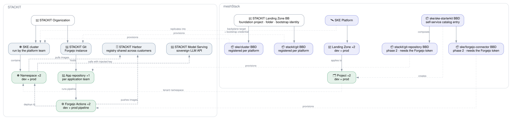

# STACKIT Kubernetes Platform

## Overview

The **STACKIT Kubernetes Platform** reference architecture delivers a complete,
sovereign-cloud Kubernetes experience on [STACKIT](https://www.stackit.de/). The architecture
provisions the cluster itself: one order creates an SKE cluster, installs an ingress controller
with Let's Encrypt certificates on it and registers it in meshStack as a Kubernetes platform whose
landing zones hand out namespaces. On top of that platform it gives application teams self-service
namespaces with integrated Git repositories and CI/CD pipelines — all running on European
infrastructure with full data sovereignty. Each team receives a ready-to-use ai-summarizer demo
application with provisioned access to STACKIT Model Serving, a sovereign LLM API, ensuring even
AI capabilities remain under full data control.

**Target audience:**

- **Platform engineers** building an internal developer platform on STACKIT.
- **Application teams** who need a fast, secure path to Kubernetes with built-in CI/CD
  in a sovereign cloud environment.

## Architecture Diagram

## How It Works

### 1. The Cluster — `STACKIT Kubernetes Cluster` building block

SKE is a managed Kubernetes service provided by STACKIT, and SKE handles control-plane management,
upgrades and scaling automatically. The architecture creates the cluster rather than expecting one
to exist. Its `TENANT_LEVEL` building block is ordered against the STACKIT Project platform, so the
cluster lands in the meshTenant's own STACKIT project, and it composes three Hub modules in a
single Terraform run:

1. **`stackit/ske`** creates the cluster and its kubeconfig.
2. **`kubernetes/platform`** registers the cluster in meshStack as a platform of type `kubernetes`
   and creates the dev and prod namespace landing zones. Application teams consume namespaces on
   it through meshStack tenants.
3. **`kubernetes/ingress`** installs cert-manager, the HAProxy ingress controller and a Let's
   Encrypt ClusterIssuer.

The team ordering a cluster decides two things: its name and how the ingress is reachable. The
`expose` input takes `public`, `internal` — which keeps the load balancer inside the STACKIT
network — or `none`, which installs no ingress controller at all. Everything else is a
landing-zone concern that the platform team sets once.

### 2. Hostnames and Certificates

Each cluster receives a **delegated DNS subzone** named after it, for example
`cluster1.likvid.stackit.run`, in the tenant's own STACKIT project. The landing zone owns the
parent zone and delegates the subzone with an NS record. The SKE managed ExternalDNS extension
writes the records from the control plane, and cert-manager holds a **single wildcard certificate**
for the whole subzone, which HAProxy serves for every application hostname.

The result is a landing zone that promises more than a namespace: an application team that adds an
Ingress with a hostname under the subzone gets a working HTTPS URL, without requesting a
certificate and without creating a DNS record.

> **Known risk — the delegated subzone is not verified yet.** STACKIT documents free `stackit.run`
> subdomains as one label deep, and it separately documents creating a subzone in a different
> project through NS delegation. Whether delegation bypasses the one-label rule *under
> `stackit.run`* is **unverified** and is being tested separately. If it does not, the fallback is
> a platform-owned zone: the parent zone stays in the platform team's project and each cluster gets
> records in it rather than a subzone of its own. The DNS handling is isolated in
> [`buildingblock/dns.tf`](buildingblock/dns.tf) so the fallback changes that one file.
>
> Creating the subzone and the NS record also needs a `modules/stackit/dns` module, which the Hub
> does not have yet. Until it exists, a platform team that wants the wildcard certificate creates
> the zone and the DNS-01 service account key by hand.

### 3. Developer Starterkit — `ske/ske-starterkit`

The starterkit is the **single entry point** for application teams. When a developer
orders the starterkit from the meshStack self-service catalog, the following resources
are created automatically:

1. **Forgejo Git repository** (`stackit/git-repository`) — a code repository hosted
   on STACKIT Git (Forgejo), optionally cloned from a template URL. Workspace members
   get team-based access (Owner → admin, Manager → write, others → read).

2. **Dev project with SKE tenant** — a meshStack project with a dedicated Kubernetes
   namespace on SKE, assigned to the dev landing zone.

3. **Dev Forgejo connector** (`ske/forgejo-connector`) — wires the Git repo to the
   dev namespace so that pushes to `dev` trigger a Forgejo Actions workflow that
   builds, pushes to the STACKIT Harbor global registry, and deploys to the dev namespace.

4. **Prod project with SKE tenant** — same as above but assigned to the prod landing
   zone.

5. **Prod Forgejo connector** — wires the Git repo to the prod namespace, triggered
   by pushes to the `prod` branch.

6. **Project Admin binding** — the requesting developer is granted Project Admin on
   both projects.

### 4. Forgejo Git Repository — `stackit/git-repository`

Each application team's repository includes:

- **Team-based access** managed via Forgejo organization teams, synced from meshStack
  workspace membership.
- **Forgejo Actions secrets** — `KUBECONFIG_DEV`, `KUBECONFIG_PROD`, container
  registry credentials, and `STACKIT_MODEL_SERVING_API_KEY` are injected automatically
  by the connector.
- **Forgejo Actions variables** — `K8S_NAMESPACE_DEV`, `K8S_NAMESPACE_PROD`,
  `APP_HOSTNAME_DEV`, `APP_HOSTNAME_PROD`, and `STACKIT_MODEL_SERVING_ENDPOINT` are
  made available to Forgejo Actions for use during Helm chart installation, avoiding
  hardcoded configuration values in stage-aware deployments.
- **Template repository** — optionally cloned from a template URL, pre-configured
  with an ai-summarizer sample application that uses the STACKIT Model Serving API.

### 5. CI/CD Pipeline — `ske/forgejo-connector`

The connector building block creates per-stage resources:

- **Kubernetes service account & RBAC** scoped to the tenant namespace, including
  read access to cert-manager cluster issuers.
- **Harbor image-pull secret** attached to the default service account so pods can
  pull images from the STACKIT Harbor registry.
- **Model Serving API secret** — a Kubernetes secret containing the `STACKIT_MODEL_SERVING_API_KEY`
  is provisioned in each dev/prod namespace, allowing applications to authenticate
  with the STACKIT Model Serving endpoint.
- **Forgejo Actions secrets & variables** for the stage-specific kubeconfig,
  namespace, Model Serving credentials, and app hostname.
- **Pipeline trigger** — after provisioning, the connector triggers the Forgejo
  Actions workflow and waits for it to complete.

## Getting Started

### Prerequisites

| Requirement          | Description                                                                                                                                       |
|----------------------|---------------------------------------------------------------------------------------------------------------------------------------------------|
| meshStack instance   | With Terraform/OpenTofu IaC runtime configured.                                                                                                   |
| STACKIT account      | With access to SKE, STACKIT Git, and the global STACKIT Harbor registry.                                                                          |
| STACKIT Project platform | Registered in meshStack, for example through the [`stackit-landingzone`](../stackit-landingzone) reference architecture. Clusters are ordered on its tenants. |
| STACKIT identity     | A service account with `ske.admin` on the organization and workload identity federation configured for the cluster building block definition.     |
| Forgejo organization | On STACKIT Git, with an API token for the Terraform provider.                                                                                     |
| Harbor credentials   | Robot account credentials (username and secret) for push/pull access to the STACKIT global Harbor registry; shared across all STACKIT customers. |
| Model Serving API    | STACKIT Model Serving endpoint and API key for the platform team to provide to the connector.                                                     |
| DNS parent zone      | A STACKIT DNS zone the landing zone owns, for example `likvid.stackit.run`. Each cluster gets a delegated subzone under it.                       |

### Deployment Order

1. Register the STACKIT Project platform, so tenants have a STACKIT project to order into.
2. Register the **STACKIT Kubernetes Cluster** building block definition from
   [`meshstack_integration.tf`](meshstack_integration.tf), setting the STACKIT identity, the ACME
   contact address and the DNS parent zone.
3. An application team orders a cluster on its STACKIT project. The order creates the cluster, its
   ingress and the Kubernetes platform with its namespace landing zones.
4. Register the starterkit and connector building block definitions against that platform.
5. Application teams order the starterkit and receive namespaces, a repository and a pipeline.

## Shared Responsibilities

| Responsibility                                           | Platform Team | Application Team |
|----------------------------------------------------------| --- | --- |
| Provide the STACKIT identity the cluster building block runs as | ✅ | ❌ |
| Own the parent DNS zone and delegate a subzone per cluster | ✅ | ❌ |
| Configure STACKIT Git (Forgejo) organization             | ✅ | ❌ |
| Manage Harbor project in global registry and credentials | ✅ | ❌ |
| Register and maintain building block definitions         | ✅ | ❌ |
| Order an SKE cluster and choose its ingress exposure     | ❌ | ✅ |
| Order starterkit from the self-service catalog           | ❌ | ✅ |
| Develop and maintain application source code             | ❌ | ✅ |
| Manage Kubernetes resources inside namespaces            | ❌ | ✅ |
| Maintain Forgejo Actions pipeline (`pipeline.yaml`)      | ❌ | ✅ |
| Monitor application health and logs                      | ❌ | ✅ |

## Why Sovereign Cloud?

This architecture runs entirely on STACKIT — a European cloud provider operated by
Schwarz Group. All data stays within EU data centers, meeting requirements for:

- **GDPR compliance** — data processing within the EU.
- **Data sovereignty** — no dependency on US-based hyperscaler infrastructure.
- **Industry regulations** — suitable for public sector, healthcare, and financial
  services workloads that require European data residency.
- **AI sovereignty** — your AI usage stays entirely European with STACKIT Model Serving.

