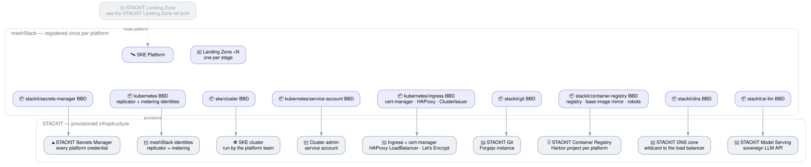
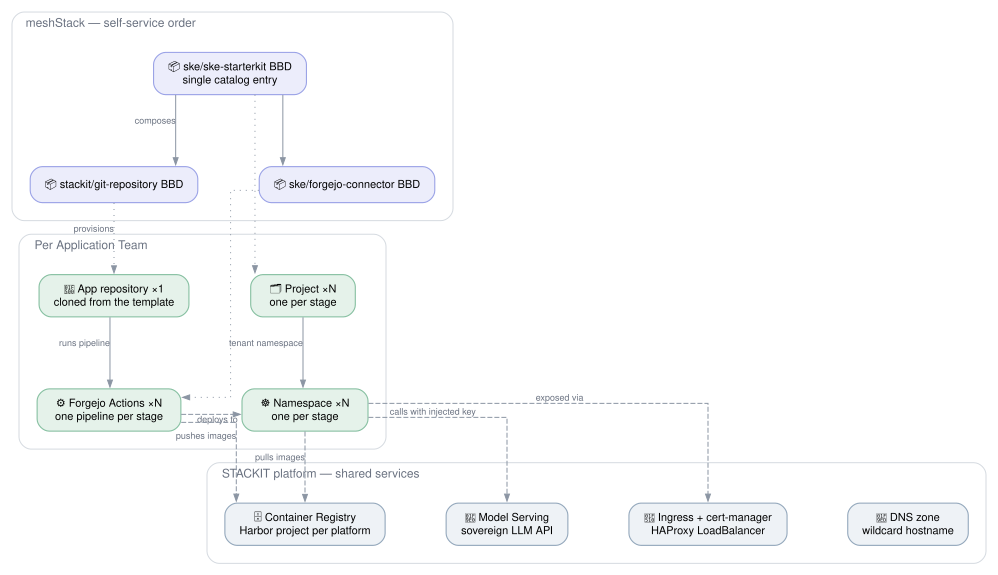
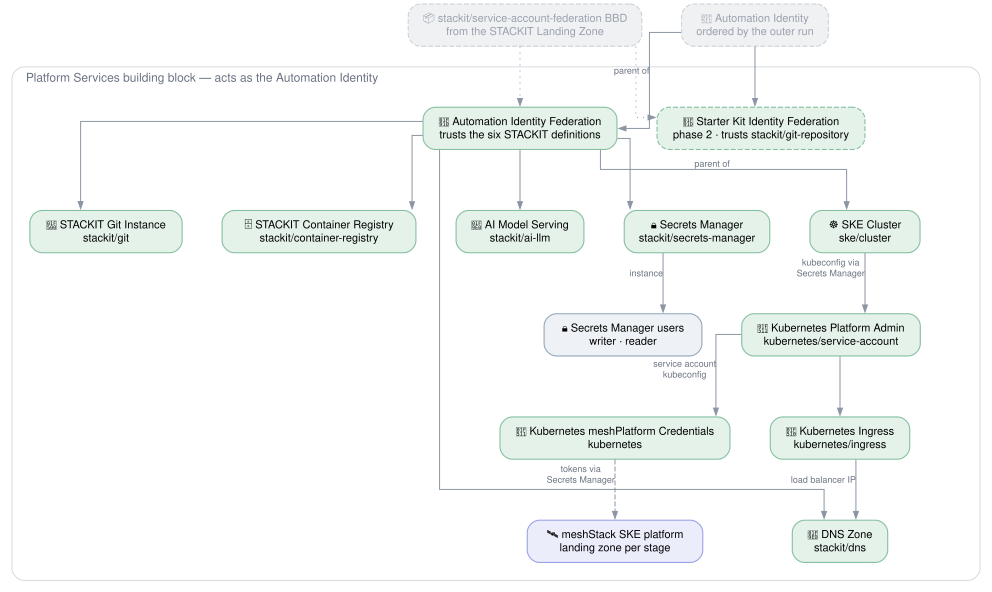

# STACKIT Kubernetes Platform

## Overview

The **STACKIT Kubernetes Platform** reference architecture delivers a complete,
sovereign-cloud Kubernetes experience on [STACKIT](https://www.stackit.de/). It combines
several Hub building blocks into a cohesive platform that gives application teams self-service
access to Kubernetes namespaces with integrated Git repositories and CI/CD pipelines —
all running on European infrastructure with full data sovereignty. Each team receives
a ready-to-use ai-summarizer demo application with provisioned access to STACKIT Model Serving,
a sovereign LLM API, ensuring even AI capabilities remain under full data control.

**Target audience:**

- **Platform engineers** building an internal developer platform on STACKIT.
- **Application teams** who need a fast, secure path to Kubernetes with built-in CI/CD
  in a sovereign cloud environment.

## Architecture

A platform engineer bootstraps the platform once; application teams then self-serve on it. The two
views split along that line.

### Platform team — one-time bootstrap

Ordered once on top of a deployed
[STACKIT Landing Zone](https://hub.meshcloud.io/reference-architectures/stackit-landingzone) (see
[What It Builds On](#what-it-builds-on-one-landing-zone-block)), it registers the SKE platform and
its building block definitions and provisions the STACKIT infrastructure. Each definition sits
directly above the resource it provisions.



### Per application team — self-service and runtime

An application team orders one starterkit and receives a repository, a project and namespace per
stage, and a CI/CD pipeline. The dashed edges are the running application's data flow across the
platform's shared STACKIT services.



## How It Works

### 1. STACKIT Kubernetes Engine (SKE)

SKE is a managed Kubernetes service provided by STACKIT. The platform team provisions
and maintains the cluster(s); application teams consume namespaces via meshStack tenants.
SKE handles control-plane management, upgrades, and scaling automatically.

### 2. Developer Starterkit — `ske/ske-starterkit`

The starterkit is the **single entry point** for application teams. When a developer
orders the starterkit from the meshStack self-service catalog, the following resources
are created automatically:

1. **Forgejo Git repository** (`stackit/git-repository`) — a code repository hosted
   on STACKIT Git (Forgejo), cloned from the template repository. Workspace members
   get team-based access (Owner → admin, Manager → write, others → read). The starterkit
   sets the application's image name on it as the `APP_NAME` Actions variable.

2. **One project with an SKE tenant per stage** — a meshStack project with a dedicated
   Kubernetes namespace on SKE, assigned to that stage's landing zone. The stages are
   the ones the platform offers, `dev` and `prod` by default.

3. **One Forgejo connector per stage** (`ske/forgejo-connector`) — wires the Git repo to
   that stage's namespace so that pushes to the stage's branch trigger a Forgejo Actions
   workflow that builds, pushes to the platform's Harbor project, and deploys to the namespace.

4. **Project Admin binding** — the requesting developer is granted Project Admin on
   every project.

### 3. Forgejo Git Repository — `stackit/git-repository`

Each application team's repository includes:

- **Team-based access** managed via Forgejo organization teams, synced from meshStack
  workspace membership.
- **Forgejo Actions secrets** — the Harbor push robot as `HARBOR_USERNAME` /
  `HARBOR_PASSWORD`, read from the platform's Secrets Manager, and `KUBECONFIG_<STAGE>`
  per stage from the connector.
- **Forgejo Actions variables** — `HARBOR_REGISTRY` and `HARBOR_PROJECT` for the whole
  platform, `APP_NAME` from the starterkit, and `K8S_NAMESPACE_<STAGE>` and
  `APP_HOSTNAME_<STAGE>` per stage from the connector, so stage-aware deployments need
  no hardcoded configuration.
- **Template repository** — cloned from the template URL, pre-configured with an
  ai-summarizer sample application that uses the STACKIT Model Serving API.

### 4. CI/CD Pipeline — `ske/forgejo-connector`

The connector building block creates per-stage resources:

- **Kubernetes service account & RBAC** scoped to the tenant namespace, including
  read access to cert-manager cluster issuers.
- **Harbor image-pull secret** attached to the default service account so pods can
  pull images from the STACKIT Harbor registry.
- **Model Serving secret** — a `stackit-ai` Kubernetes secret with `STACKIT_AI_BASE_URL`,
  `STACKIT_AI_API_KEY` and `STACKIT_AI_MODEL` in each stage's namespace, so applications
  can call STACKIT Model Serving.
- **Forgejo Actions secrets & variables** for the stage-specific kubeconfig,
  namespace and app hostname.
- **Pipeline trigger** — after provisioning, the connector triggers the Forgejo
  Actions workflow and waits for it to complete.

## What It Builds On: One Landing Zone Block

This architecture sits on top of a deployed
[STACKIT Landing Zone](https://hub.meshcloud.io/reference-architectures/stackit-landingzone). That
landing zone provides the STACKIT organization structure, the foundation project and the platform
this architecture's hosting project is created on — and nothing Kubernetes- or Git-specific. It does
not register the SKE cluster or STACKIT Git definitions; **this architecture registers those itself,
once per ordered platform**, so every platform owns its own definitions and its own service
account.

Wiring is a single input, **STACKIT Landing Zone**. You copy its value from the summary of the landing
zone building block, which shows it as a code block. It holds

- `platform_ref` and `landingzone_refs` — the meshPlatform and landing zone the hosting project is
  created on, and
- `service_account_bbd_version_ref` and `service_account_federation_bbd_version_ref` — the
  **STACKIT Service Account** and **STACKIT Service Account Federation** definitions this
  architecture orders to mint its own identity and to federate its definitions into it.

**No STACKIT credential crosses that boundary, and this architecture holds none.** It orders the
service account definition on the hosting tenant it just created, granting the account `editor` and
`iam.member-admin`, and federates every definition whose runs create STACKIT resources into that
account. Each of those building blocks names the account in its `STACKIT_SERVICE_ACCOUNT_EMAIL`
input, so every STACKIT resource here is created by a building block authenticating through
workload identity federation. How the order is split so that this works in one apply is in
[The Outer Layer](#the-outer-layer).

The definitions the starter kit orders are federated by a federation of their own, **Starter Kit
Identity Federation**. Today that is the **STACKIT Git Repository** definition: its runs list the
instance's users through the STACKIT Git API to match workspace members by email, because the
Forgejo token's technical user is restricted and cannot see them.

Adding a STACKIT capability to this architecture means adding its role to the landing zone's
`stackit_assignable_roles`, its definition's uuid to `federated_building_block_definitions`, and the
federation to its building block's parents. It never means adding a credential.

## Building Block Tree



The tree hangs below one nested building block, **Platform Services**, which the outer layer
orders. Every building block in it names its parents in `parent_building_block_refs`, so meshPanel
shows this tree and meshStack runs a child only after its parents:

- **Automation Identity Federation** is a child of the Automation Identity, across the nesting. It
  needs the uuids of the six definitions whose runs act as the account, so it can only be ordered
  after they are registered.
- **Starter Kit Identity Federation** is also its child. It needs the uuid of the Git repository
  definition, so it belongs to phase 2.
- The six blocks that act as the account are children of the federation. The **Kubernetes
  Platform Admin** service account is also a child of the cluster, because it takes the cluster's
  kubeconfig. The Kubernetes meshPlatform Credentials and the Ingress are children of the service
  account, because they take its kubeconfig. The DNS zone is also a child of the Ingress, because it
  takes the load balancer IP.

Three rules keep this tree deletable:

- **Delete a child's definition before its parent's.** meshStack deletes a definition's building
  blocks with it, and fails with a `fk_tbb_Parent` foreign key error if one of them is still the
  parent of another block. So the service account definition depends on the cluster definition,
  and the platform credentials and ingress definitions on the service account definition.
- **The Secrets Manager goes last.** Its two users and every block that writes to it take its
  instance id, so OpenTofu deletes them before the instance.
- **The service account depends on no definition it federates.** If it did, a parent definition
  that reads the account's email and its child definition would depend on each other, and OpenTofu
  would report a cycle. That is why the federation is a building block of its own.

### Secrets

No building block in the tree outputs a secret. The nested run orders the platform's Secrets
Manager and creates a writer and a reader user in it. Each block that creates a credential gets the writer login and a
path in its `output_to_vault` input and writes the credential there. The nested run reads what a
definition it registers needs with the reader login, as an ephemeral value, and hands it on as a
write-only input:

| Path | Written by | Read for |
|---|---|---|
| `cluster/ske` | SKE Cluster | the Kubernetes Platform Admin definition |
| `cluster/serviceaccount` | Kubernetes Platform Admin | the meshPlatform Credentials and Ingress definitions |
| `kubernetes/platform` | Kubernetes meshPlatform Credentials | the meshStack SKE platform |
| `git/forgejo-api-token` | STACKIT Git Instance | the Git Repository and Forgejo Connector runs |
| `registry/push` | STACKIT Container Registry | the Git Repository runs |
| `registry/pull` | STACKIT Container Registry | the Forgejo Connector runs |
| `ai/model-serving` | AI Model Serving | the Forgejo Connector runs, for the `stackit-ai` secret |

The Forgejo Connector definition also gets `cluster/serviceaccount` as its kubeconfig. The phase 2
definitions get the reader login and the paths instead of the values, and each of their runs reads
the secrets it needs. The Git Repository runs keep the push robot in their state, because the
restapi provider has no write-only attributes. The Forgejo Connector runs keep nothing they read.

An ephemeral value has no version meshStack could compare. Each block that writes a secret reports
the secret's path and a hash of its content in its `vault_secret` output, and the nested run uses
that hash as the version of the kubeconfigs and meshPlatform tokens it hands on. A changed secret,
for example after the SKE credentials were rotated, therefore reaches the definitions on the next
nested run. The Forgejo Connector gets one hash of the pull robot and the AI secret as its
`secrets_revision`, so its runs write the Kubernetes secrets again when either changes.

## The Outer Layer

A platform engineer orders one building block, **STACKIT Kubernetes Platform**. Its run has no
STACKIT identity, because the stackit provider rejects a
service account email that is unknown while planning, so a run cannot act as an account it creates
itself. It therefore only bootstraps, in one apply:

1. the meshProject and the hosting tenant, which is the platform's STACKIT project,
2. the **Automation Identity**, the one service account of the platform,
3. the **Bootstrap Identity Federation**, a child of the Automation Identity that trusts only the
   one definition this run registers, the nested **STACKIT Kubernetes Platform Services**
   definition,
4. one **Platform Services** building block, ordered from the nested definition with the service
   account's email as a known input. It acts as the account from its first run and orders the tree
   above, the platform's Secrets Manager included.

The outer run waits for the nested building block and shows its summary as its own. Every input of
the outer building block that the tree needs reaches it through the nested building block's
inputs, so updating the outer building block is the only way to change the platform.

## Ordering It: One Order, One Update

One run provisions everything:

- the hosting STACKIT project (a self-hosted meshStack tenant), the platform's service account, its
  federations and its Secrets Manager,
- the **SKE Cluster**, **STACKIT Git Instance**, **Container Registry**, **DNS Zone** and **AI Model
  Serving** building block definitions, registered for this platform and federated into that
  service account,
- the SKE cluster, and the cluster-admin service account (`kubernetes/service-account`) the blocks
  working inside it use,
- **ingress** (`kubernetes/ingress`) — cert-manager, the HAProxy ingress controller and the Let's
  Encrypt ClusterIssuer, in a single building block,
- the **meshStack Kubernetes integration** (`kubernetes`), which creates the replicator and metering
  identities and registers the meshStack platform they are wired into, with one landing zone per
  stage,
- the **DNS zone** with a wildcard record pointing at the ingress load balancer, and the **AI Model
  Serving** token,
- the **STACKIT Git instance** (`stackit/git`) — named after the platform identifier, because
  `<name>.git.onstackit.cloud` is globally unique across all of STACKIT, which is why a playground
  deployment suffixes that identifier — with its **Forgejo organization** and the **STACKIT-hosted
  shared runner** it orders through `shared_runner_labels`, labelled `stackit-ubuntu-22` for the
  application workflows,
- the **container registry**, with every meshStack user on the platform's project granted a STACKIT
  registry role so the Harbor project is visible to them, and the template's base images mirrored
  into it through `mirrored_base_images`.

The one step left is the Harbor bootstrap robot, which only the STACKIT portal can create. The
summary says how. Updating the building block with its name in **Harbor Bootstrap Robot Name**
mints the push and pull robots and registers the **STACKIT Git Repository**, **SKE Forgejo
Connector** and **SKE Starterkit** definitions, so application teams can order a repository wired
to their namespaces.

### Where the Forgejo token comes from

No human mints it. The Git building block creates a technical user through the STACKIT Git API
and exchanges that user's password for a Personal Access Token, which it writes to the Secrets
Manager at `git/forgejo-api-token`, where the Git Repository and Forgejo Connector runs read it. See
`modules/stackit/git/buildingblock/README.md` for the two calls involved.

## Adopting Existing Resources

The optional **Imports** input lets the platform take over resources that already exist, for
example a platform built before this architecture, instead of creating them:

| Key | Takes over | Taken over by |
|---|---|---|
| `project = {display_name}` | the meshProject **Project Identifier** and its tenant on the landing zone platform; with the optional `display_name`, the project keeps that display name | the outer run |
| `ske = {}` | the SKE cluster **Cluster Name** in that tenant's STACKIT project | the SKE Cluster building block |
| `git = {instance_id, instance_name, forgejo_organization, existing_forgejo_api_token_path}` | the STACKIT Git instance in that project and its Forgejo organization | the STACKIT Git Instance building block |

`ske` and `git` need `project`, because the cluster and the instance live in its STACKIT project.
Everything else is created new, also when it is adopted: the service account and its federations,
the Secrets Manager, the kubeconfig, the DNS zone, the ingress and the meshStack platform. The Git
building block creates its own technical user with a random suffix, because the instance's existing
user has a password it does not know, and it orders no shared runner, because STACKIT allows one
per instance.

To take over the organization, the Git building block needs a token of one of its owners: it makes
its own technical user an owner with it, and removes that user again on deletion. It reads the token
from `existing_forgejo_api_token_path` in the platform's Secrets Manager, under the key
`forgejo_api_token`. The Secrets Manager is created by the platform, so hand the token over in the
sensitive **Import Secrets** input, a map of Secrets Manager paths to secrets, which the nested run
writes before it orders the Git building block:

```hcl
{
  "imports/git/forgejo-api-token" = { forgejo_api_token = "<token>" }
}
```

The organization keeps its settings and is never deleted. Its new `writers` and `readers` teams carry
the technical user's suffix, because the organization may already have teams of these names.

What happens on deletion depends on **Playground Mode**:

- **Playground**: deleting the platform leaves what it took over in place, and only drops it from
  the state.
- **Production**: the platform manages what it took over, so deleting the platform deletes it.

An adopted resource gets the settings this architecture gives it, so the first run may change it.
To review that run before it applies, switch on the `building_block_creation` and
`any_input_changes` gates in `approval_policies` for the adoption, and switch them off afterwards.

The ingress installs cluster-wide objects (cert-manager CRDs, the IngressClass, the ClusterIssuer).
An adopted cluster that already runs an ingress from another building block collides with it. Use
that ingress instead through the optional **Existing Ingress and DNS Zone** input,
`{ingress_load_balancer_ip, dns = {zone_name}}`: the platform then orders neither an
ingress nor a DNS zone, and builds application hostnames under the given zone, whose wildcard record
must already point at the load balancer. Unlike **Imports**, it takes over nothing: deleting the
platform leaves the ingress and the zone alone. Nothing passes the IngressClass and ClusterIssuer
names on to applications, so the existing ingress should serve the ones the platform's own would:
`haproxy` and `letsencrypt-prod`.

## Getting Started

### Prerequisites

| Requirement          | Description                                                                                                          |
|----------------------|----------------------------------------------------------------------------------------------------------------------|
| meshStack instance   | With Terraform/OpenTofu IaC runtime configured.                                                                      |
| STACKIT Landing Zone | A deployed STACKIT Landing Zone building block. The code block in its summary is the only value wired into this architecture — see above. |
| STACKIT portal       | Access to the platform's Harbor project, to create its one bootstrap robot account.                                 |

### The Harbor bootstrap robot is still a manual step

The container registry building block creates the Harbor project and mints the push and pull robots,
but only from a robot that already exists. The Harbor API opens only to an identity Harbor already
knows, and only the portal can link the first robot to a STACKIT service account. That robot's name
is the one optional input the architecture waits for; its password is never needed.

### Approval Gates

`approval_policies` sets which run triggers need an operator's approval before a run of this
architecture is applied, and the same gates apply to the definitions it registers for the platform:
Secrets Manager, Platform Services, SKE cluster, Kubernetes service account, STACKIT Git, container
registry, DNS, AI LLM, Kubernetes and ingress.
`starterkit_approval_policies` does the same for the definitions application teams order: Git
repository, Forgejo connector and SKE starterkit. Both default to no gate at all.

## Shared Responsibilities

| Responsibility                                           | Platform Team | Application Team |
|----------------------------------------------------------| --- | --- |
| Provision and manage SKE cluster                         | ✅ | ❌ |
| Configure STACKIT Git (Forgejo) organization             | ✅ | ❌ |
| Manage Harbor project in global registry and credentials | ✅ | ❌ |
| Register and maintain building block definitions         | ✅ | ❌ |
| Manage STACKIT DNS zone for app hostnames                | ✅ | ❌ |
| Order starterkit from the self-service catalog           | ❌ | ✅ |
| Develop and maintain application source code             | ❌ | ✅ |
| Manage Kubernetes resources inside namespaces            | ❌ | ✅ |
| Maintain Forgejo Actions pipeline (`pipeline.yaml`)      | ❌ | ✅ |
| Monitor application health and logs                      | ❌ | ✅ |

## Why Sovereign Cloud?

This architecture runs entirely on STACKIT — a European cloud provider operated by
Schwarz Group. All data stays within EU data centers, meeting requirements for:

- **GDPR compliance** — data processing within the EU.
- **Data sovereignty** — no dependency on US-based hyperscaler infrastructure.
- **Industry regulations** — suitable for public sector, healthcare, and financial
  services workloads that require European data residency.
- **AI sovereignty** — your AI usage stays entirely European with STACKIT Model Serving.

