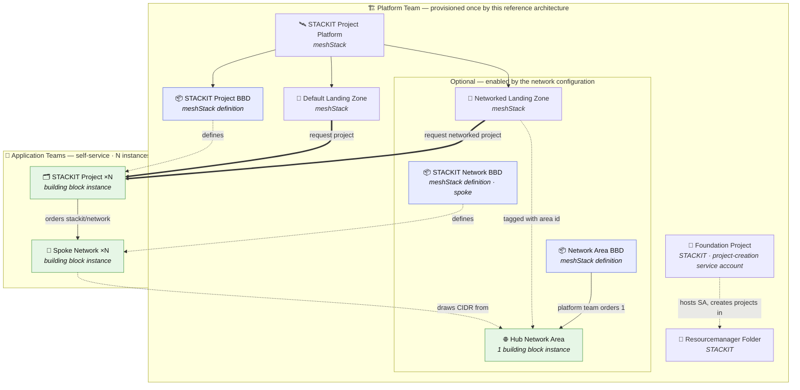

# STACKIT Landing Zone

## Overview

The **STACKIT Landing Zone** reference architecture turns a bare STACKIT organization into a
self-service-ready meshStack platform in one step using its own Terraform code.

The **always-on** foundation is a sandbox landing zone: a dedicated STACKIT resourcemanager
folder, a foundation project hosting the project-creation service account, and the **STACKIT
Project** platform with its default landing zone. Application teams can immediately request
STACKIT projects against it.

Optionally, by providing a **network** configuration, the same building block layers on a
hub-and-spoke network topology with IPAM built in: a shared network-area address plan (the hub)
that all tenant projects draw from, and a self-service routed-network building block (the spoke)
application teams can order inside their own projects. Leaving the network configuration unset
deploys only the sandbox foundation.

**Target audience:**

- **Platform engineers** onboarding a new STACKIT organization into meshStack who want a sandbox
  environment application teams can request projects from immediately — optionally with network
  segmentation from day one, without hand-wiring a network area and its address plan separately.
- **Application teams** who need a dedicated IPv4 subnet inside their STACKIT project without
  manually coordinating CIDR ranges with the platform team (when networking is enabled).

## Architecture Diagram

The diagram separates the **platform artifacts** provisioned once by the platform team — the
STACKIT cloud objects (folder, foundation project), the meshStack platform, landing zones, and the
building block **definitions** (BBDs) registered in meshStack — from the **application landing zone
objects** that application teams instantiate `N` times in self-service. Building block definitions
(blue) are registered once; building block **instances** (green) are ordered against them — the hub
network area is a single instance the platform team orders, while STACKIT projects and spoke
networks are ordered `N` times by application teams.

When networking is enabled, application teams order a routed network into their own project via the
self-service `stackit/network` building block; each order draws its subnet from the hub's address
plan, so no two spokes can accidentally collide on CIDR ranges.

## How It Works

Running this reference architecture always:

1. Creates a **STACKIT resourcemanager folder** under the given organization — new STACKIT
   projects are created inside this folder.
2. Creates a **STACKIT foundation project** directly under the organization to host the
   project-creation service account and other landing-zone core assets.
3. Sources the [`modules/stackit`](../../modules/stackit) platform integration to register the
   **STACKIT Project** platform and its default landing zone in meshStack, wired to the foundation
   service account.

When a **network** configuration is provided, it additionally:

4. Registers the [`stackit/network-area`](../../modules/stackit/network-area) building block
   definition and immediately orders **one instance** of it in the platform team's own workspace —
   this is the hub's IPv4 address plan.
5. Registers the [`stackit/network`](../../modules/stackit/network) building block definition
   (`TENANT_LEVEL`) so application teams can self-service order routed networks (spokes) inside
   their STACKIT projects, drawing from the hub's address plan.
6. Provisions an additional **networked landing zone**, tagged with the hub's network area ID, so
   new STACKIT projects created against it are placed in the hub's network area.

## Getting Started

### Prerequisites

| Requirement          | Description                                                                       |
|----------------------|-----------------------------------------------------------------------------------|
| STACKIT organization | With a service account key that has `resource-manager.admin` on the organization. |
| CIDR plan            | *(Only when enabling networking)* A non-overlapping IPv4 address plan chosen up front for the hub network ranges and transfer network. |

### Deployment Order

Order the **STACKIT Landing Zone** building block once per workspace. Without a network
configuration it creates the platform and default landing zone. With a network configuration it
additionally creates the hub network area instance, the networked landing zone, and registers the
spoke `stackit/network` building block in the same apply. Application teams can then request
projects and — when networking is enabled — order `stackit/network` inside their own STACKIT
projects once those projects exist.

## Shared Responsibilities

| Responsibility                                                                | Platform Team | Application Team |
|-------------------------------------------------------------------------------|:---:|:---:|
| Provision the STACKIT platform and default landing zone                       | ✅ | ❌ |
| *(Optional)* Provision the hub network area and choose its address plan       | ✅ | ❌ |
| *(Optional)* Register the spoke `stackit/network` building block              | ✅ | ❌ |
| Request STACKIT projects through the landing zone                             | ❌ | ✅ |
| *(Optional)* Order spoke networks inside their STACKIT projects               | ❌ | ✅ |
| Use the assigned subnet and manage workloads inside their projects            | ❌ | ✅ |
