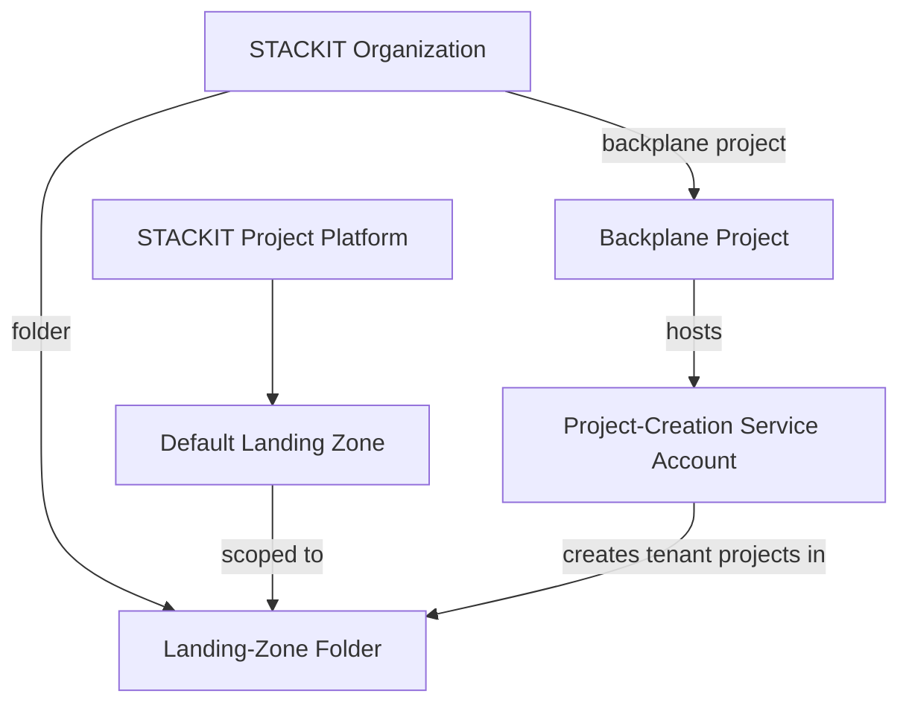

# STACKIT Sandbox Landing Zone

## Overview

The **STACKIT Sandbox Landing Zone** reference architecture turns a bare STACKIT organization
into a self-service-ready meshStack platform in one step using its own Terraform code.

**Target audience:**

- **Platform engineers** onboarding a new STACKIT organization into meshStack who want a
  sandbox environment application teams can request projects from immediately.

## Architecture Diagram

## How It Works

Running this reference architecture:

1. Creates a **STACKIT resourcemanager folder** under the given organization — new STACKIT
   projects are created inside this folder.
2. Creates a **STACKIT backplane project** directly under the organization to host the
   project-creation service account.
3. Sources the [`modules/stackit`](../../modules/stackit) platform integration to register the
   **STACKIT Project** platform and its default landing zone in meshStack, wired to the
   backplane service account.

## Getting Started

### Prerequisites

| Requirement          | Description                                                                       |
|----------------------|-----------------------------------------------------------------------------------|
| STACKIT organization | With a service account key that has `resource-manager.admin` on the organization. |
